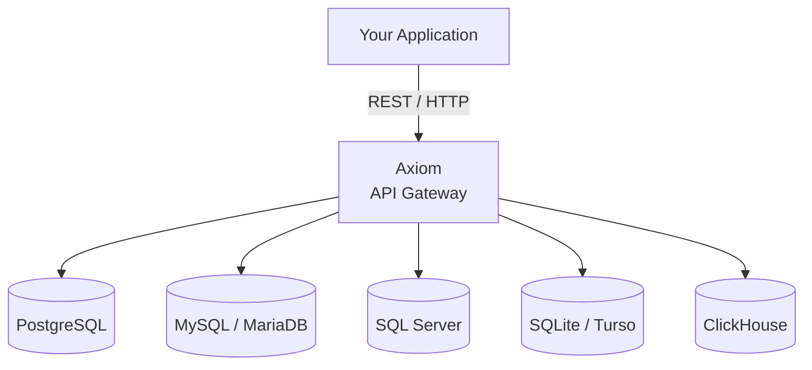
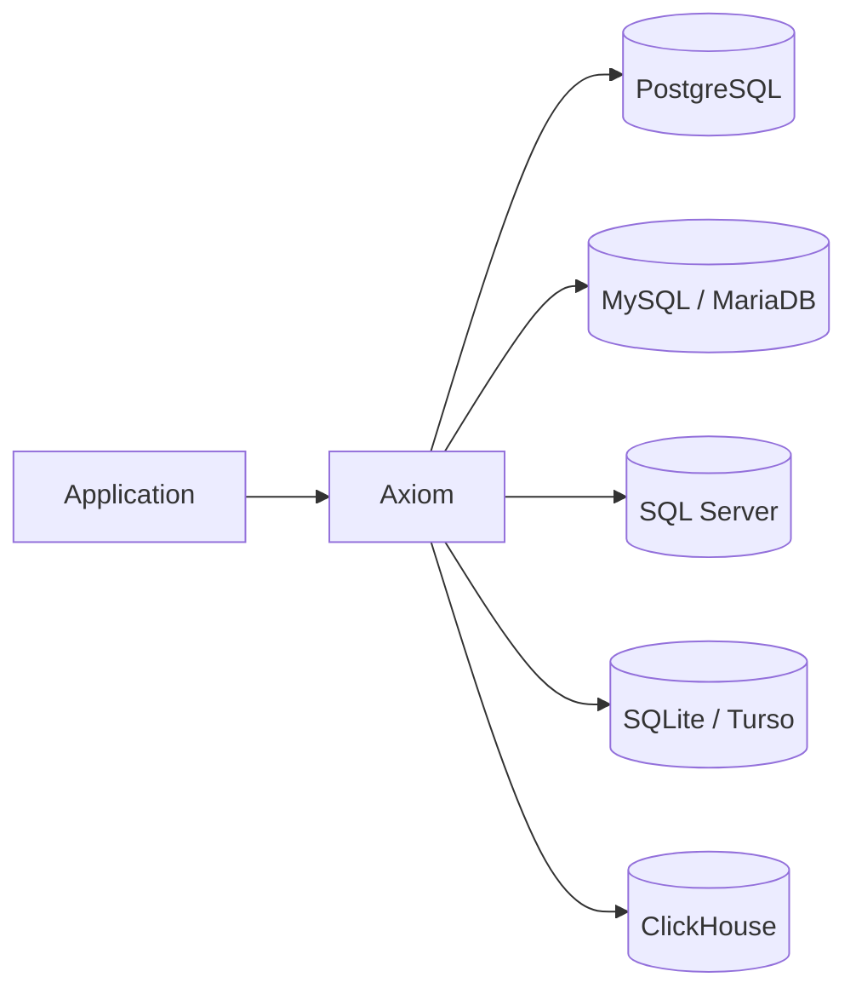
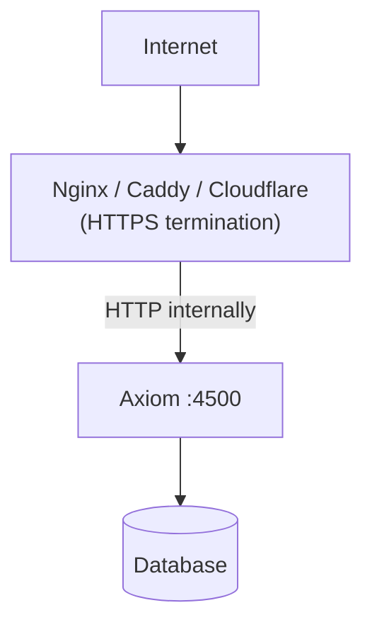
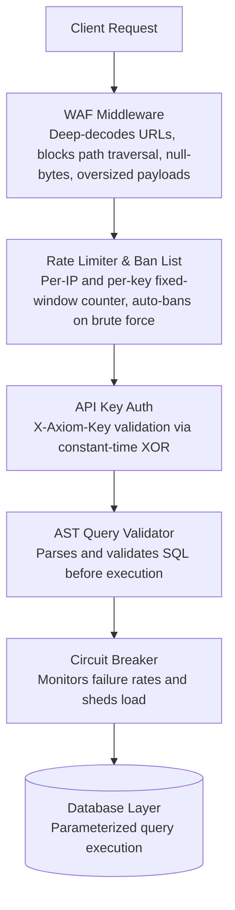

<div align="center">

# Axiom

### Ultra-Lightweight Database API Gateway

**One API. Multiple SQL backends. Built for speed, security, and simplicity.**

<p align="center">
  <a href="./docs/">Documentation</a>
  &nbsp;&nbsp;•&nbsp;&nbsp;
  <a href="./demos/">Examples</a>
  &nbsp;&nbsp;•&nbsp;&nbsp;
  <a href="./LICENSE">License</a>
</p>

</div>

<br>

<div align="center">


</div>

## Overview

**Axiom** is an open-source, ultra-lightweight API gateway developed by **[Toxichome](https://toxichome.cc)** that exposes SQL databases through a unified, secure REST API.

Instead of building and maintaining database-specific APIs for every project, Axiom sits between your application and your SQL backends as a single, hardened gateway layer.



## Why Axiom?

| Principle | Description |
| --- | --- |
|  **Lightweight** | Minimal overhead with a high-performance Rust implementation using `mimalloc`. |
|  **Database Agnostic** | A unified API that works across PostgreSQL, MySQL, MariaDB, SQL Server, SQLite, Turso, and ClickHouse. |
|  **Secure by Default** | Authentication, rate limiting, WAF protections, and request validation built-in. |
|  **Zero-Contention Config** | Config is loaded once via `OnceLock<Arc<Config>>`  no locking overhead on every request. |


## Core Features

### High Performance

- Rust-based implementation with `mimalloc` global allocator (developed by Microsoft)
- Fully asynchronous request handling via `tokio`
- Dynamic database connection pooling via `sqlx`
- Lock-free rate-limit counters using `AtomicU32`
- Zero-copy JSON streaming cache  cache hits skip SQL compilation and memory allocation entirely

### Unified Database API

Interact with multiple SQL databases through a single, consistent REST interface:



### Security

Security is enforced at the gateway layer before any query reaches the database:

- `X-Axiom-Key` API key authentication with constant-time XOR validation
- AST-based SQL query validation (blocks injections at the parse tree level)
- Multi-tier rate limiting with automatic IP ban list for brute-force attacks
- Idempotency engine for safe request retries
- Circuit breaker for database health tracking and connection shedding
- WAF middleware (blocks path traversal via deep-decode, null-byte injections, 10MB default body limit)
- Configurable per-database query blacklists and dangerous operation guards
- Structured audit logging per query including UUID tracing

### Lock-Free Configuration

Global configuration is loaded once at startup and shared immutably:

```rust
OnceLock<Arc<AxiomConfig>>
```

Every worker thread reads config with zero lock acquisition overhead.


## Quick Start

### 1. Clone the repository

```bash
git clone https://github.com/toxichome-whoami/axiom.git
cd axiom
```

### 2. Configure

Copy the example config and fill in your database credentials:

```bash
cp config.example.toml config.toml
```

Edit `config.toml` and add your database connection and API key.

### 3. Build & Run

**Windows (recommended  uses `run.ps1` wrapper):**

```powershell
.\run.ps1
```

This builds the release binary, injects Windows metadata, and starts the server automatically.

**Manual build:**

```bash
cargo build --release
./target/release/axiom        # Linux / macOS
.\target\release\axiom.exe   # Windows
```

**Cross-compile for Linux from Windows:**

```powershell
.\run.ps1 -linux
```

### Docker

```bash
docker compose up -d
```

### Default Port

```text
HTTP / REST  localhost:4500
```


## API Example

Authenticate all requests using the `X-Axiom-Key` header.

### Query a Database

```bash
curl -X POST "http://localhost:4500/api/v1/db/main_db/query" \
  -H "X-Axiom-Key: <YOUR_API_KEY>" \
  -H "Content-Type: application/json" \
  -d '{
    "sql": "SELECT id, name FROM users WHERE active = $1",
    "params": {"1": true}
  }'
```

### List Databases

```bash
curl -X GET "http://localhost:4500/api/v1/db/databases" \
  -H "X-Axiom-Key: <YOUR_API_KEY>"
```

### Fetch Rows (Paginated)

```bash
curl -G "http://localhost:4500/api/v1/db/main_db/users/rows" \
  -H "X-Axiom-Key: <YOUR_API_KEY>" \
  --data-urlencode "limit=50" \
  --data-urlencode "sort=id" \
  --data-urlencode "order=desc"
```

For the full API reference, see **[docs/features/API.md](./docs/features/API.md)**.


## Golang Demos

Axiom includes a collection of **Go demos** showing how to interact with the gateway over REST.

```bash
cd demos
go run . [demo_name]
```

### Available demos

| Demo | Purpose |
| --- | --- |
| `db_fetch` | Fetch rows from a database |
| `db_insert` | Insert rows into a database |
| `db_drop` | Drop database tables |

Copy `demos/.env.example` to `demos/.env` and fill in your server URL and API key before running.


## Project Structure

```text
axiom/
 src/                 # Core Rust implementation
 demos/               # Golang REST API examples
 benches/             # Go benchmark suite
 docs/                # Full documentation
 scripts/             # Build and metadata scripts
 tools/               # Build tooling (rcedit)
 run.ps1              # Windows build & run wrapper
 config.example.toml  # Configuration template
 docker-compose.yml   # Docker deployment
 Cargo.toml           # Rust project manifest
```


## Documentation

The `docs/` directory contains full documentation for Axiom:

- API reference
- Configuration reference
- Deployment guide
- Security model

**[ Read the Documentation](./docs/)**


## Development

```bash
# Debug build
cargo build

# Run directly
cargo run

# Optimized release
cargo build --release

# Lint and auto-fix
cargo clippy --fix
```


## Deployment

### Binary

Upload the compiled binary and your `config.toml` to your server:

```bash
chmod +x axiom
./axiom
```

### Docker

```bash
docker compose up -d
```

### Reverse Proxy (Recommended for Production)

Always place Axiom behind a reverse proxy for HTTPS termination:



> Never expose port `4500` directly to the public internet without HTTPS in front of it.


## Security Model




## Contributing

Contributions are welcome.

Before submitting changes:

```bash
cargo check
cargo clippy
cargo build
```

For larger changes, review the architecture and docs under `docs/`.


## License

MIT © [Toxichome](https://toxichome.cc)
