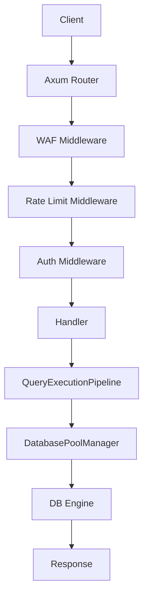
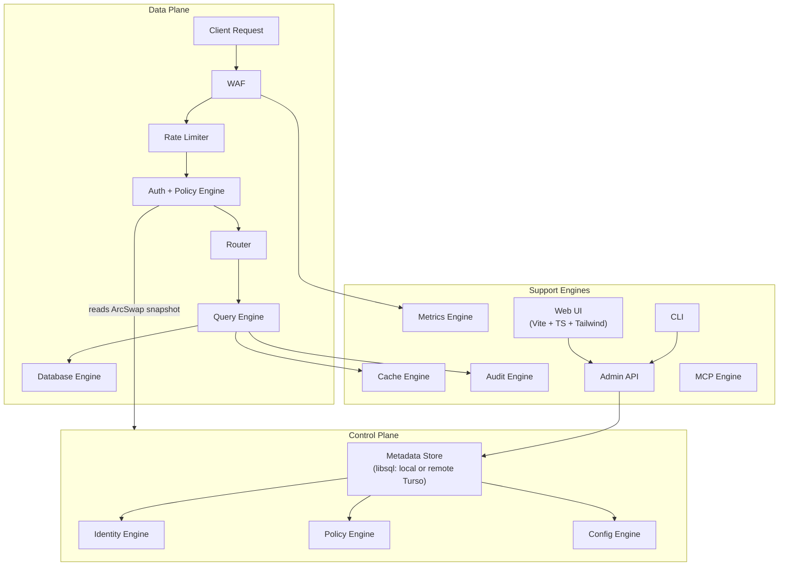

# AXIOM MASTER PLAN — Enterprise-Grade Re-Architecture
Version 4.0, Status: Active, Updated 2026-09-27
Brief intro: this document is the source of truth; update it when implementation diverges

**Section 1: Product Vision**
Axiom is a single-binary Rust API gateway that sits between applications and SQL databases. Two properties:
- SMALL: download binary → run → connect DB → API works. <10MB RAM, fast startup.
- POWERFUL: RBAC, audit, metrics, persistent caching, HA, CLI, Web UI, MCP.

**Section 2: Architecture Principles (numbered list of 10)**
1. Measure, don't assume. Every performance claim needs a reproducible benchmark.
2. Hot path is sacred. Request path must allocate as little as possible.
3. Engines are cooperating modules, not microservices. No inter-process comms.
4. Control plane / data plane are logically separated (same process by default).
5. Optional systems add zero CPU/memory when disabled.
6. Server config is immutable at runtime. Metadata (keys, roles, DBs) is hot-reloadable.
7. Security is centralized — auth + authz in one place, not scattered in handlers.
8. Every error is typed. No Box<dyn Error> on hot paths.
9. Binary stays small. Feature-gate heavy optional components.
10. Compatibility over freshness. /api/v1/ must not break without a major version bump.

**Section 3: Current Architecture Audit**

Describe the v3.0.1 request pipeline with this Mermaid flowchart:


Then a table of 10 architectural debt items:
| # | Location | Problem |
| 1 | handlers.rs:68,91 | ConfigManager::get() called twice per request in run_query |
| 2 | base.rs:42 | Box<dyn Error> return on DB engine hot path |
| 3 | auth.rs:41 + rate_limit.rs:30 | Ban-list checked twice (both middlewares) |
| 4 | handlers.rs:66 | CIRCUIT_FAILURES static defined inside a function body |
| 5 | handlers.rs:48-53 | Cache evicts an arbitrary key, not LRU |
| 6 | schema.rs:208 | full_admin: bool hardcoded privilege — no role model |
| 7 | handlers.rs:89 | Regex mutation check + AST parse both run every uncached request |
| 8 | pool.rs:33 | Single global INIT_LOCK blocks all DB cold-starts |
| 9 | cache.rs | Three disconnected cache stores, no shared eviction/observability |
| 10 | All handlers | Response shape built inline in each handler — no shared schema |

**Confirmed Security Bypasses (fix in Phase 0)**

| # | Location | Bypass | Severity | Fix |
|---|----------|--------|----------|-----|
| S1 | rate_limit.rs:22 | If `trusted_proxies` is set to `"*"`, attacker sends arbitrary `X-Forwarded-For` header and Axiom rate-limits that spoofed IP instead of the real one — infinite bypass | Critical | Warn on startup if `trusted_proxies = ["*"]`; document that `"*"` must never be used in production |
| S2 | rate_limit.rs:56 | Rate limit keyed only by IP (`rl:ip:{ip}`). An attacker with one valid API key rotating through multiple IPs gets a fresh rate limit bucket each time — key is never throttled | Medium | Add parallel `rl:key:{key_name}` counter; enforce the lower of IP limit and key limit |
| S3 | rate_limit.rs | No global auth failure counter per key. Distributed brute-force (1000 IPs each trying 1 wrong key guess) never triggers per-IP ban | Medium | Track global failed-auth count per key name; ban key after threshold regardless of source IP |


**Section 4: Competitive Research**

- Faucet (Go): single binary, embedded SQLite config DB, RBAC, MCP, CLI-first, OpenAPI auto-gen. Key lessons: embedded config DB enables live reconfiguration; CLI and Web UI call same admin API.
- Hasura: control/data plane separation, metadata-driven API, permission predicate pushdown. Key lesson: compile-once metadata → execute-many pattern; auth constraints compiled into SQL.
- PostgREST (Haskell): DB-as-authority, schema cache invalidated via NOTIFY, PostgreSQL binary protocol. Key lesson: cache the schema, not just queries.
- Redis: single-threaded event loop, AOF+RDB persistence, LRU/LFU eviction. Key lesson: separate hot-data path from persistence; ack before fsync.

**Section 5: Target Architecture**



**Section 6: RBAC Auth Model**

```sql
CREATE TABLE roles (name TEXT PRIMARY KEY, description TEXT, created_at INTEGER);

CREATE TABLE permissions (
    id INTEGER PRIMARY KEY AUTOINCREMENT,
    role_name TEXT NOT NULL REFERENCES roles(name),
    database TEXT NOT NULL,    -- '*' = all
    table_name TEXT NOT NULL,  -- '*' = all
    operations TEXT NOT NULL   -- JSON: ["SELECT","INSERT","UPDATE","DELETE"]
);

CREATE TABLE api_keys (
    name TEXT PRIMARY KEY,
    secret_hash BLOB NOT NULL,  -- BLAKE3(secret), never plaintext
    role_name TEXT REFERENCES roles(name),
    rate_limit INTEGER,
    expires_at INTEGER,
    created_at INTEGER NOT NULL
);
```

There are no built-in roles. Every role is user-defined. On first boot, Axiom creates no default roles — the operator must create at least one role and one key via the Admin API or CLI before the data API accepts requests.

Auth flow description: extract X-Axiom-Key → base64 decode → lookup in metadata snapshot (ArcSwap<Metadata>, zero locks) → BLAKE3(secret) == stored_hash (constant-time) → load role permissions → PolicyEngine::evaluate → inject AuthContext.

Backward compat note: [api_key.*] in config.toml is seeded into axiom.db on first boot.

**Section 7: Metadata Store**

```toml
[metadata]
url   = "file:data/axiom.db"   # local SQLite, default
token = ""                      # empty for local
# url   = "libsql://your-db.turso.io"  # remote Turso
# token = "your-turso-token"
reload_interval = 30  # seconds between snapshot refreshes
```

Explain: data plane never queries axiom.db on hot path. Reads ArcSwap<Metadata> snapshot. Background daemon refreshes every 30s or on /admin/v1/reload.

**Section 8: Implementation Phases**

| Phase | Name | Goal |
| 0 | Hot-path cleanup | Remove 10 debt items. No new features. |
| 1 | Metadata Store + Identity | libsql axiom.db, ArcSwap snapshot, Admin API for keys/databases |
| 2 | Policy Engine / RBAC | roles, permissions, PolicyEngine::evaluate, table-level access |
| 3 | CLI | axiom key|db|cache|health|metrics|logs|benchmark subcommands |
| 4 | MCP Engine | /mcp/v1 endpoint, AI agent SQL access, same policy enforcement |
| 5 | Cache Engine | Unified L1+L2, LRU eviction, optional AOF, unified stats |
| 6 | Observability | Prometheus /metrics, structured audit log |
| 7 | Web UI | Vite+TS+Tailwind, embedded in binary, /ui/ |
| 8 | Hardening | Security tests, fuzz, 30m soak, CI gates |

**Section 9: API Specification**

URL map:
```
Data API (v1 — preserved, not breaking):
  POST   /api/v1/db/:alias/query
  GET    /api/v1/db/:alias/tables
  GET    /api/v1/db/:alias/:table/rows
  POST   /api/v1/db/:alias/:table/rows
  PATCH  /api/v1/db/:alias/:table/rows
  DELETE /api/v1/db/:alias/:table/rows
  GET    /api/v1/db/:alias/:table/schema
  GET    /api/v1/db/databases

Admin API (Phase 1+, requires admin role):
  GET    /admin/v1/status
  POST   /admin/v1/reload
  GET    /admin/v1/keys
  POST   /admin/v1/keys
  DELETE /admin/v1/keys/:name
  GET    /admin/v1/roles
  POST   /admin/v1/roles
  PATCH  /admin/v1/roles/:name
  DELETE /admin/v1/roles/:name
  GET    /admin/v1/databases
  POST   /admin/v1/databases
  DELETE /admin/v1/databases/:alias
  GET    /admin/v1/audit
  POST   /admin/v1/cache/flush
  GET    /admin/v1/cache/stats
  GET    /admin/v1/metrics
  GET    /admin/v1/health

MCP: POST /mcp/v1
Web UI: GET /ui/*
Core: GET /health | GET /ready | GET /metrics (optional)
```

Response envelope:
```json
{
  "success": true,
  "data": { ... },
  "meta": { "request_id": "uuid", "duration_ms": 1.23, "cached": false },
  "error": null
}
```

**Section 10: Resource Profiles**

| Profile | Workers | Cache | Metrics | Web UI | Audit | Target RSS |
|---------|---------|-------|---------|--------|-------|------------|
| minimal | 1 | off | off | off | off | ~8 MB |
| standard | auto | memory | basic | on | on | ~25 MB |
| production | auto | memory+journal | full | on | on | ~50 MB |
| enterprise | auto | snapshot | full+OTel | on | on | configurable |

**Section 11: Performance Targets**

Note clearly: "These are engineering targets. No target ships to public documentation without a linked benchmark result."

| Metric | Target | Test |
|--------|--------|----- |
| Cache GET (L1, hot) | < 1 µs p50 | bench_cache.go 1M ops |
| Auth (warm snapshot) | < 5 µs | bench_auth.go |
| Full pipeline, cache hit | < 500 µs p50 | bench_http.go |
| Full pipeline, local DB query | < 2 ms p50 | bench_db.go localhost |
| Binary size (stripped) | < 15 MB | cargo build --release |
| Cold start to first 200 OK | < 200 ms | process timing |
| Idle RSS (minimal profile) | < 10 MB | ps -o rss, 60s idle |
| Idle RSS (standard profile) | < 30 MB | ps -o rss, 60s idle |

**Section 12: Compatibility Requirements**

- config.toml format: all existing keys continue to work
- /api/v1/ endpoints: response shape unchanged
- X-Axiom-Key auth header: unchanged
- Linux glibc 2.17+ deployment: unchanged
- Single binary + config.toml model: unchanged
- [api_key.*] and [database.*] in TOML: still supported, seeded into axiom.db on first boot

**Section 13: What Is Not Being Built**

- GraphQL (out of scope)
- gRPC (out of scope)
- ORM or query builder
- Multi-tenancy (isolation between unrelated organizations)
- Performance claims in docs without benchmark citations
