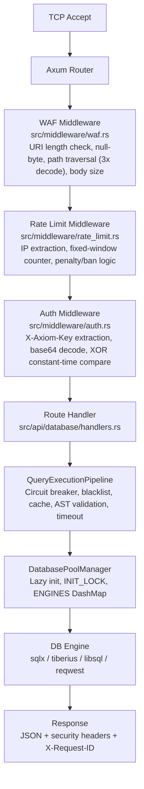

# Request Pipeline Architecture

## v3.0.1 Pipeline

Every inbound HTTP request passes through the following stack in order (Axum applies middleware in reverse — WAF fires first):

## Security Headers (every response)

| Header | Value |
|--------|-------|
| `X-Request-ID` | UUID v4 per request |
| `X-Content-Type-Options` | `nosniff` |
| `X-Frame-Options` | `DENY` |
| `Strict-Transport-Security` | `max-age=63072000; includeSubDomains; preload` |
| `Content-Security-Policy` | `default-src 'none'; frame-ancestors 'none';` |

## Known Issues (v3.0.1)

See [AXIOM_MASTER_PLAN.md](../AXIOM_MASTER_PLAN.md) Section 3 for the full list of architectural debt being addressed in v4.0.

## Target Architecture (v4.0)

See [AXIOM_MASTER_PLAN.md](../AXIOM_MASTER_PLAN.md) Section 5.
