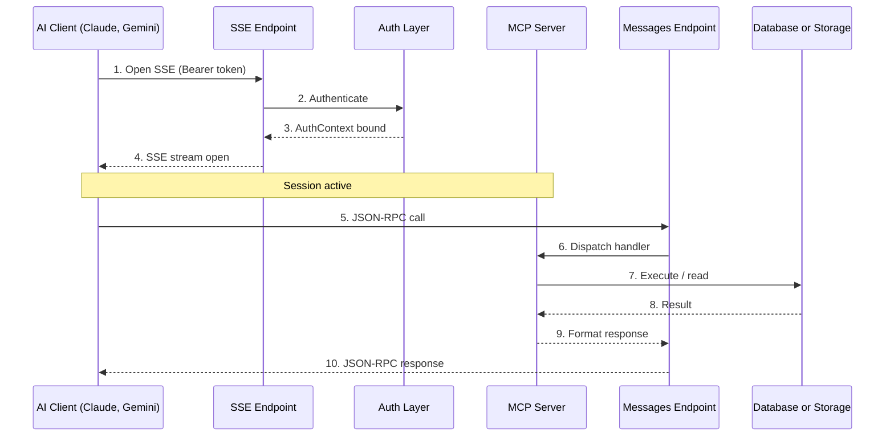

<div align="center">
  <h1>Axiom MCP Guide</h1>
  <p><em>Standardized Model Context Protocol for secure AI assistant integrations</em></p>
</div>

<hr/>

MCP lets AI assistants like **Claude**, **Gemini**, and **Copilot** securely interact with your Axiom databases and files through a standardized SSE-based interface.

## 1. Quick Start

<details open>
<summary><b>Step 1: Configure Axiom</b></summary>

```toml
# config.toml
[features]
mcp = true

[mcp]
server_name = "axiom"
server_version = "1.0.4"
max_result_rows = 50
max_directory_entries = 100
max_file_read_bytes = 1048576
```
</details>

<details open>
<summary><b>Step 2: Connect your Client</b></summary>

**Using the MCP CLI (Python):**
```bash
pip install mcp
mcp connect http://localhost:4500/api/v1/mcp/sse \
  --headers "Authorization: Bearer $(echo -n 'admin:YOUR_SECRET' | base64)"
```

**Or configure Claude Desktop:**
```json
// ~/.config/Claude/claude_desktop_config.json
{
  "mcpServers": {
    "axiom": {
      "command": "mcp",
      "args": ["connect", "http://your-server.com:4500/api/v1/mcp/sse"],
      "env": {
        "MCP_TOKEN": "<base64-admin-key:secret>"
      }
    }
  }
}
```
</details>

---

## 2. How It Works

MCP uses a **bidirectional SSE** (Server-Sent Events) transport:



### Step-by-Step

1. The client opens an SSE connection (`GET /sse`) with an API key
2. Axiom authenticates the key via the same auth pipeline as REST (ban check, dynamic/static key lookup)
3. The `AuthContext` is stored in a per-session `ContextVar` — all subsequent tool calls inherit its permissions
4. The SSE stream stays open — the client sends JSON-RPC messages and receives responses over the same connection
5. Tool calls (`list_tables`, `query_database`, etc.) go through the same validation pipeline as REST API calls
6. All operations run with the API key's `mode`, `db_scope`, and `fs_scope`

> <span style="font-size: 1.2em;"></span> **Key difference from REST API:** MCP sessions are stateful — the auth context is bound to the SSE connection, not per-request. This lets AI models maintain context across multiple tool calls without re-authenticating each time.

---

## 3. Configuration

```toml
[mcp]
server_name = "axiom"              # Server identity sent to AI clients
server_version = "1.0.4"           # Version advertised in initialization
max_result_rows = 50               # Max rows returned per query
max_directory_entries = 100        # Max files listed per directory
max_file_read_bytes = 1048576      # Max file read size (1 MB)
```

### Safety Caps

| Setting | Default | Why |
|---------|---------|-----|
| <kbd>max_result_rows</kbd> | `50` | Prevents large results from blowing the AI model's context window |
| <kbd>max_directory_entries</kbd> | `100` | Caps directory listings to avoid timeout on large folders |
| <kbd>max_file_read_bytes</kbd> | `1 MB` | Limits memory per file read — files over this size return an error |

### Zero-Cost When Disabled

When `features.mcp = false`:
- **Zero imports** — the MCP router is lazy-imported inside a conditional
- **Zero routes** — no SSE or messages endpoints exist in the ASGI app
- **Zero memory** — no MCP classes instantiated, no registries populated
- **Zero CPU** — no background tasks or timers

---

## 4. Available Tools

### Database Tools

<table style="width: 100%; border-collapse: collapse;">
  <tr style="background-color: #2d2d2d; color: white;">
    <th style="padding: 10px;">Tool</th>
    <th style="padding: 10px;">Description</th>
    <th style="padding: 10px;">Parameters</th>
  </tr>
  <tr>
    <td style="padding: 10px;"><code>list_databases</code></td>
    <td style="padding: 10px;">Lists accessible database aliases</td>
    <td style="padding: 10px;"><em>(none)</em></td>
  </tr>
  <tr>
    <td style="padding: 10px;"><code>list_tables</code></td>
    <td style="padding: 10px;">Lists tables in a database with column previews</td>
    <td style="padding: 10px;"><code>database: str</code></td>
  </tr>
  <tr>
    <td style="padding: 10px;"><code>describe_table</code></td>
    <td style="padding: 10px;">Full column definitions (types, PK, nullable)</td>
    <td style="padding: 10px;"><code>database: str</code>, <code>table: str</code></td>
  </tr>
  <tr>
    <td style="padding: 10px;"><code>query_database</code></td>
    <td style="padding: 10px;">Execute AST-validated SQL</td>
    <td style="padding: 10px;"><code>database: str</code>, <code>sql: str</code></td>
  </tr>
</table>

> **`query_database` security:** SQL is parsed by `sqlglot` AST parser. Injection attempts are rejected before reaching the database. Only the authenticated key's `mode` and `db_scope` are enforced. Queries are transpiled automatically.

### Storage Tools

<table style="width: 100%; border-collapse: collapse;">
  <tr style="background-color: #2d2d2d; color: white;">
    <th style="padding: 10px;">Tool</th>
    <th style="padding: 10px;">Description</th>
    <th style="padding: 10px;">Parameters</th>
  </tr>
  <tr>
    <td style="padding: 10px;"><code>list_storages</code></td>
    <td style="padding: 10px;">Lists accessible storage aliases</td>
    <td style="padding: 10px;"><em>(none)</em></td>
  </tr>
  <tr>
    <td style="padding: 10px;"><code>list_files</code></td>
    <td style="padding: 10px;">Lists directory contents (capped)</td>
    <td style="padding: 10px;"><code>storage: str</code>, <code>path: str</code></td>
  </tr>
  <tr>
    <td style="padding: 10px;"><code>read_file</code></td>
    <td style="padding: 10px;">Reads text file content (capped)</td>
    <td style="padding: 10px;"><code>storage: str</code>, <code>path: str</code></td>
  </tr>
</table>

> **`read_file` security:** Path traversal attacks are blocked by canonical resolution. File reads are offloaded to a thread pool — event loop is never blocked.

---

## 5. Available Resources

Resources provide structured context that AI models can read inline (without tool calls).

| Resource URI | Description |
|-------------|-------------|
| `axiom://db/{alias}/schema` | Full database schema (tables, columns, types, PKs) |
| `axiom://fs/{alias}/info` | Storage volume configuration and limits |

*Resources respect the same auth scopes as tools.*

---

## 6. Security

### Protections

| Threat | Mitigation |
|--------|-----------|
| **SQL injection** | `sqlglot` AST parser rejects malformed/malicious SQL before execution |
| **Path traversal** | `os.path.realpath` canonical comparison blocks `../` escapes |
| **Symlink TOCTOU** | `O_NOFOLLOW` + post-open realpath verification (Linux) |
| **File bomb** | `max_file_read_bytes` cap — files over limit return error, not memory |
| **Directory bomb** | `max_directory_entries` cap — lists are truncated safely |
| **Auth bypass** | Same auth path as REST API — HMAC + SHA-256 |
| **Session hijack** | `ContextVar` scoped per async task, cleared in `finally` block |
| **Enumeration** | Generic "access denied" messages — no name leak on scope violations |

---

## 7. Client Setup Examples

<details>
<summary><b>Custom Python Client</b></summary>

```python
import asyncio
import httpx
from mcp import ClientSession
from mcp.client.sse import sse_client

async def main():
    token = "YWRtaW46W..."
    headers = {"Authorization": f"Bearer {token}"}

    async with sse_client(
        url="http://localhost:4500/api/v1/mcp/sse",
        headers=headers,
    ) as (read, write):
        async with ClientSession(read, write) as session:
            await session.initialize()

            # List databases
            result = await session.call_tool("list_databases", {})
            print(result.content[0].text)

            # Query a database
            result = await session.call_tool(
                "query_database",
                {"database": "main_db", "sql": "SELECT * FROM users LIMIT 5"},
            )
            print(result.content[0].text)

asyncio.run(main())
```
</details>

<details>
<summary><b>cURL (for testing)</b></summary>

```bash
# Send a tools/list request via POST
curl -X POST "http://localhost:4500/api/v1/mcp/messages" \
  -H "Authorization: Bearer YWRtaW46W..." \
  -H "Content-Type: application/json" \
  -d '{"jsonrpc": "2.0", "id": 1, "method": "tools/list"}'
```
</details>

---

## 8. Performance Profile

| Scenario | Memory | CPU | Event Loop Blocking |
|----------|--------|-----|---------------------|
| MCP disabled (idle) | **0 KB** | **0%** | None |
| Query database (1 row) | ~10 KB | ~1ms | **0ms** (async) |
| Read file (1 MB) | ~1 MB | ~2ms | **0ms** (thread pool) |

---

## 9. Troubleshooting

<details>
<summary><b>"MCP_AUTH_FAILED"</b></summary>
<br>
The API key is invalid, expired, or the token format is wrong.<br><br>
<i>Fix: Ensure the Authorization header is <br>
<code>Bearer &lt;base64("key_name:secret")&gt;</code></i>
</details>

<details>
<summary><b>"Access denied"</b></summary>
<br>
The API key exists but does not have permission for that database or storage.<br><br>
<i>Fix: Check the key's <code>db_scope</code> or <code>fs_scope</code> in <code>config.toml</code>.</i>
</details>

<details>
<summary><b>"File too large"</b></summary>
<br>
The file exceeds <code>max_file_read_bytes</code> (default 1 MB).<br><br>
<i>Fix: Increase the limit in <code>config.toml</code> under <code>[mcp]</code>.</i>
</details>
