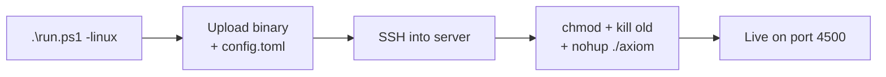

<div align="center">

# Axiom - Build, Deploy & Run Guide

*Local development, Windows builds, Linux cross-compilation, VPS, cPanel, and Docker deployment*

</div>


## 1. Local Development (Windows)

All Windows builds are handled by the `run.ps1` wrapper — it compiles, injects metadata, and starts the server automatically.

### Quick Start

```powershell
# Build release + inject metadata + auto-launch
.\run.ps1
```

### Dev Build (fast, unoptimized)

```powershell
cargo build
.\target\debug\axiom.exe
```

### Validate Code (no binary produced)

```powershell
cargo check
cargo clippy
```

### Stop the Server

```powershell
Get-Process axiom -ErrorAction SilentlyContinue | Stop-Process -Force
```


## 2. Cross-Compile for Linux (One-Time Setup)

Build a native Linux binary directly from Windows — no Docker, no VM needed.

### Step 1 - Install Zig (cross-linker)

Download from [ziglang.org/download](https://ziglang.org/download/), extract to `C:\zig`, and add `C:\zig` to your Windows `PATH`.

### Step 2 - Install cargo-zigbuild

```powershell
cargo install cargo-zigbuild
```

### Step 3 - Add Linux target to Rust

```powershell
rustup target add x86_64-unknown-linux-gnu
```

### Step 4 - Build

```powershell
.\run.ps1 -linux
```

> [!NOTE]
> The `-linux` flag injects the MSYS2 toolchain path and runs `cargo zigbuild --target x86_64-unknown-linux-gnu.2.17 --release`.
> Targeting glibc `2.17` ensures the binary runs on any modern Linux host — CentOS 7, AlmaLinux, Ubuntu, Debian — with no shared libs required.

**Output binary:**
```
target\x86_64-unknown-linux-gnu.2.17\release\axiom
```

| Property | Value |
|---|---|
| Format | ELF 64-bit Linux binary |
| glibc target | 2.17 (maximum compatibility) |
| Dependencies | None — fully static |
| Works on | CentOS 7+, AlmaLinux, Ubuntu, Debian, any cPanel host |


## 3. Deploy to cPanel (Run on Every Update)



### Step 1 - Build the Linux binary

```powershell
.\run.ps1 -linux
```

### Step 2 - Upload to cPanel

**Option A - cPanel File Manager:**
1. Login to cPanel → File Manager
2. Navigate to your folder (e.g. `/home/yourusername/axiom/`)
3. Upload `target\x86_64-unknown-linux-gnu.2.17\release\axiom`
4. Upload `config.toml` if it changed

**Option B - SCP (if SSH is enabled):**
```bash
scp target\x86_64-unknown-linux-gnu.2.17\release\axiom user@yourserver.com:/home/user/axiom/axiom
scp config.toml user@yourserver.com:/home/user/axiom/config.toml
```

### Step 3 - Stop the old version

```bash
kill $(pgrep axiom)

# If pgrep is not available:
ps aux | grep axiom     # find the PID
kill <PID>
```

### Step 4 - Make executable and run in background

```bash
cd /home/yourusername/axiom

# First time only
chmod +x axiom

# Start in background (persists after SSH logout)
nohup ./axiom > axiom.log 2>&1 &
echo "Axiom started. PID: $!"
```

> [!IMPORTANT]
> Always use `nohup ... &` on shared hosting. Without it, Axiom will be killed the moment you close your SSH terminal.


## 4. Deploy to VPS / Bare Metal (Linux)

Upload the binary and config to your server, then run it as a systemd service for automatic startup and crash recovery.

```bash
# Upload binary and config
scp target\x86_64-unknown-linux-gnu.2.17\release\axiom user@yourserver.com:/opt/axiom/axiom
scp config.toml user@yourserver.com:/opt/axiom/config.toml
```

### Run as a Systemd Service

Create `/etc/systemd/system/axiom.service`:

```ini
[Unit]
Description=Axiom API Gateway
After=network.target

[Service]
Type=simple
User=www-data
WorkingDirectory=/opt/axiom
ExecStart=/opt/axiom/axiom
Restart=on-failure
RestartSec=5s
Environment=RUST_LOG=warn

[Install]
WantedBy=multi-user.target
```

Then enable and start:

```bash
sudo systemctl daemon-reload
sudo systemctl enable axiom
sudo systemctl start axiom
sudo systemctl status axiom
```


## 5. Deploy with Docker

```bash
# Build the image (multi-stage: compiles Rust then copies binary into slim runtime)
docker build -t axiom:latest .

# Run with config file mounted
docker run -d \
  --name axiom \
  -p 4500:4500 \
  -v $(pwd)/config.toml:/app/config.toml \
  -v $(pwd)/data:/app/data \
  -v $(pwd)/logs:/app/logs \
  axiom:latest
```

### Docker Compose

```bash
cp config.example.toml config.toml
docker compose up -d
```


## 6. Nginx Reverse Proxy

> [!IMPORTANT]
> Always place Axiom behind a reverse proxy in production. Never expose port `4500` directly to the internet — API keys travel in plain HTTP headers and must be encrypted by TLS.

```nginx
server {
    listen 80;
    server_name api.toxichome.cc;
    return 301 https://$host$request_uri;
}

server {
    listen 443 ssl;
    server_name api.toxichome.cc;

    ssl_certificate     /etc/ssl/certs/api.crt;
    ssl_certificate_key /etc/ssl/private/api.key;
    ssl_protocols       TLSv1.2 TLSv1.3;

    client_max_body_size 10m;

    location / {
        proxy_pass         http://127.0.0.1:4500;
        proxy_set_header   Host              $host;
        proxy_set_header   X-Real-IP         $remote_addr;
        proxy_set_header   X-Forwarded-For   $proxy_add_x_forwarded_for;
        proxy_set_header   X-Forwarded-Proto $scheme;
    }
}
```


## 7. Useful Server Commands

**Is Axiom running?**
```bash
ps aux | grep axiom | grep -v grep
```

**View live logs**
```bash
tail -f ~/axiom/axiom.log
```

**View last 100 log lines**
```bash
tail -n 100 ~/axiom/axiom.log
```

**Restart Axiom**
```bash
kill $(pgrep axiom) && nohup ~/axiom/axiom >> ~/axiom/axiom.log 2>&1 &
```

**Stop Axiom**
```bash
kill $(pgrep axiom)
```


## 8. Auto-Restart on Crash (cPanel Cron Job)

Set up a watchdog using cPanel's built-in cron system — no root required.

1. Go to **cPanel → Cron Jobs → Add New Cron Job**
2. Set frequency to **Every Minute** (`* * * * *`)
3. Set the command *(replace `yourusername` with your actual cPanel username)*:

```bash
pgrep -x axiom || (cd /home/yourusername/axiom && nohup ./axiom >> axiom.log 2>&1 &)
```

## 9. Updating Axiom

```powershell
# 1. Pull latest code
git pull origin main

# 2. Rebuild Linux binary
.\run.ps1 -linux

# 3. Upload and restart (see Section 3 or 4)
```


## 10. Production Checklist

> [!CAUTION]
> Do not skip this before going live.

- [ ] Replace all placeholder secrets in `config.toml` with cryptographically random values (>= 32 chars)
  ```bash
  openssl rand -hex 32
  ```
- [ ] Set `server.host = "0.0.0.0"` only if behind a reverse proxy
- [ ] Set `server.cors_origins` to your actual domain(s), not `"*"`
- [ ] Terminate TLS at Nginx, Caddy, or Cloudflare — never expose port `4500` raw
- [ ] Set `RUST_LOG=warn` to reduce log volume in production
- [ ] Confirm `database.<alias>.dangerous_operations = false` on all databases
- [ ] Add your server IP to `server.allowed_ips` to exempt it from rate limiting
- [ ] Ensure `data/` and `logs/` directories are not web-accessible


## 11. Port Reference

| Port | Protocol | Description |
|---|---|---|
| `4500` | HTTP / REST | Primary API port (Axiom) |
| `80` / `443` | HTTP / HTTPS | Public-facing (Apache/Nginx proxies to 4500) |

> [!TIP]
> Never expose port `4500` directly to the internet. Always proxy through Apache (`.htaccess`), Nginx, or Cloudflare so your API keys are encrypted in transit.


<div align="center">

*Axiom — a [Toxichome](https://toxichome.cc) open-source project*

</div>
