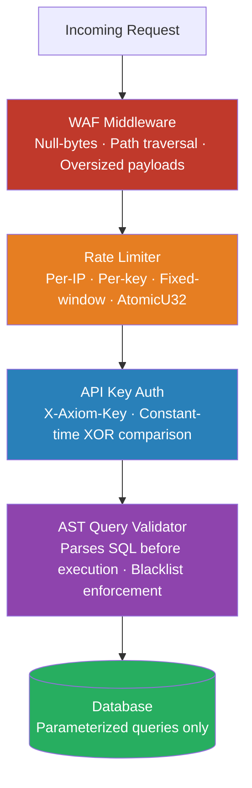

<div align="center">

# Axiom Security Model

*Security-first architecture engineered to withstand real-world API attack vectors*

</div>


## Request Pipeline

Every request flows through a layered security stack before touching any database logic.




## 1. Authentication

All API endpoints (except `GET /` and `GET /ready`) require the `X-Axiom-Key` header.

```http
X-Axiom-Key: your-api-key-secret
```

> [!IMPORTANT]
> Axiom uses **constant-time secret comparison** via a custom XOR byte loop to prevent timing attacks. An attacker cannot determine how many characters of a key are correct based on response time.

### Scope-Based Access Control

Every API key is configured with explicit restrictions:

| Property | Controls |
|---|---|
| `mode` | `readonly`, `writeonly`, or `readwrite` |
| `db_scope` | Which database aliases the key can access |
| `full_admin` | Whether the key can perform admin operations |
| `rate_limit_override` | Per-key request rate cap (0 = global default) |

Permissions are enforced at the intersection of the **key's mode** and the **database's configured mode**. A `readwrite` key against a `readonly` database results in read-only access.


## 2. Web Application Firewall (WAF)

Axiom includes an embedded WAF (`src/middleware/waf.rs`) that runs **before any business logic**.

| Check | Description |
|---|---|
| **Payload size** | Rejects requests exceeding `server.body_limit`, enforced by `DefaultBodyLimit` (10MB hard cap) |
| **Null-byte injection** | Strips and blocks null bytes (`\x00`) in URLs and headers |
| **Path traversal** | Deep-decodes URL up to 3 times to block `%252e%252e` bypass and other encoded variants |
| **Suspicious patterns** | Blocks common exploit strings in URL and header values |

> [!NOTE]
> The WAF runs at the Tower service layer  below the Axum router  meaning it operates at raw TCP protocol level with no boxing overhead per request.


## 3. Rate Limiting

Multi-tier fixed-window rate limiting backed by lock-free `AtomicU32` counters.

| Tier | Scope | Config Key |
|---|---|---|
| Global | All requests | `rate_limit.max_requests` |
| Per-key | Per API key | `rate_limit_override` on `[api_key.*]` |
| Per-IP | Per client IP | `rate_limit.max_requests` |

**How the counter works:**
- Each IP stores exactly **2 values**  a counter and an expiry timestamp
- Counters are incremented atomically with zero lock contention (`AtomicU32::fetch_add`)
- RAM usage is **constant** regardless of request volume or concurrent attackers
- After `penalty_threshold` violations, the IP is temporarily banned for `penalty_cooldown` seconds

### Brute Force Ban List
Axiom actively monitors failed authentication attempts. 5 failed auth attempts from the same IP triggers `BanList::ban_ip()`, automatically banning the offending IP to prevent credential stuffing and brute force attacks.


## 4. SQL Injection Protection

Axiom operates at **two levels** to prevent SQL injection:

### Level 1 - AST Query Validator
All raw SQL submitted to `/query` is parsed into an Abstract Syntax Tree before execution. The parser enforces:
- `query_blacklist`  rejects queries containing blocked SQL verbs (`DROP`, `TRUNCATE`, `ALTER` by default)
- `dangerous_operations = false`  blocks all DDL by default

### Level 2 - Parameterized Queries
All internally constructed queries (insert, fetch, update, delete) use `sqlx::query().bind()`  driver-level parameterized bindings. String interpolation is strictly prohibited in the data layer.

> [!CAUTION]
> Even with these protections, the `/query` endpoint executes raw SQL. Only expose this endpoint to trusted backend services  never directly to a frontend or end user.


## 5. Circuit Breaker

The Circuit Breaker pattern is fully implemented to protect upstream databases from cascading failures. It tracks connection and query failures per DB alias. Once the `failure_threshold` is hit, the circuit opens, immediately rejecting requests and allowing the database time to recover.

## 6. Idempotency Engine

Safe request retries are supported on the `/query` endpoint via the `Idempotency-Key` header. Cached responses are returned for duplicate requests without re-executing the query or hitting the database, preventing double-execution on network retries.

## 7. Audit Logging

A structured audit log is recorded per query, capturing detailed context for compliance and security review. It logs the database alias, authenticated user, actual query executed, rows affected, and rows returned.

## 8. Security Headers

Every response from Axiom includes a hardened set of HTTP security headers injected by `SecurityHeadersMiddleware`:

| Header | Value | Purpose |
|---|---|---|
| `X-Content-Type-Options` | `nosniff` | Prevent MIME sniffing |
| `X-Frame-Options` | `DENY` | Prevent clickjacking |
| `X-XSS-Protection` | `1; mode=block` | Legacy XSS filter |
| `Cache-Control` | `no-store` | Prevent response caching |
| `Strict-Transport-Security` | `max-age=63072000; includeSubDomains; preload` | Force HTTPS |
| `Content-Security-Policy` | `default-src 'none'; frame-ancestors 'none';` | Prevents rendering and execution |

> [!TIP]
> The security header sets are **pre-computed as immutable tuples at startup**  zero allocation cost per response.


## 9. Attack Protection Summary

| Threat | Protection |
|---|---|
| **SQL Injection** | AST validation + parameterized `sqlx` bindings |
| **Brute Force** | Multi-tier rate limiting + IP ban with penalty cooldown |
| **Timing Attacks** | Constant-time secret comparison via custom XOR byte loop |
| **Path Traversal** | WAF null-byte and deep URL decoding to catch `%252e%252e` |
| **DDoS** | Lock-free O(1) rate counter, constant RAM under any load |
| **Oversized Payloads** | WAF limits bodies via `DefaultBodyLimit` (10MB max) |
| **MIME Sniffing** | `X-Content-Type-Options: nosniff` on all responses |
| **Clickjacking** | `X-Frame-Options: DENY` and CSP `frame-ancestors 'none'` |
| **Key Leaks** | Keys never logged; never sent as query parameters |


## 10. Production Security Recommendations

> [!WARNING]
> These are not optional in a real deployment.

- **Use HTTPS**  Always terminate TLS at Nginx, Caddy, or Cloudflare. API keys are transmitted in plain HTTP headers  they **must** be encrypted in transit.

- **Restrict `db_scope`**  Never use `["*"]` on API keys exposed to external services. Create separate scoped keys per service.

- **Generate strong secrets**  Use `openssl rand -hex 32` to generate your API key secrets. Minimum 32 characters.
  ```bash
  openssl rand -hex 32
  ```

- **Lock down `dangerous_operations`**  Keep `dangerous_operations = false` (default) on all databases. Only enable for trusted internal migration tooling.

- **Protect your config**  Your `config.toml` contains database URLs and API key secrets. Ensure it is not web-accessible. The `.htaccess` included in this repo blocks it at the Apache layer.

- **Rotate keys regularly**  If a key is suspected to be compromised, remove it from `config.toml` and restart Axiom.

- **Log at `WARN` in production**  Avoid `DEBUG` or `TRACE` in production as they may log partial request data.
  ```toml
  [logging]
  level = "WARN"
  ```


<div align="center">

*Axiom  a [Toxichome](https://toxichome.cc) open-source project*

</div>
