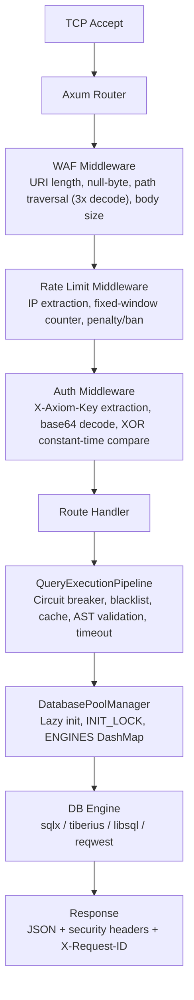
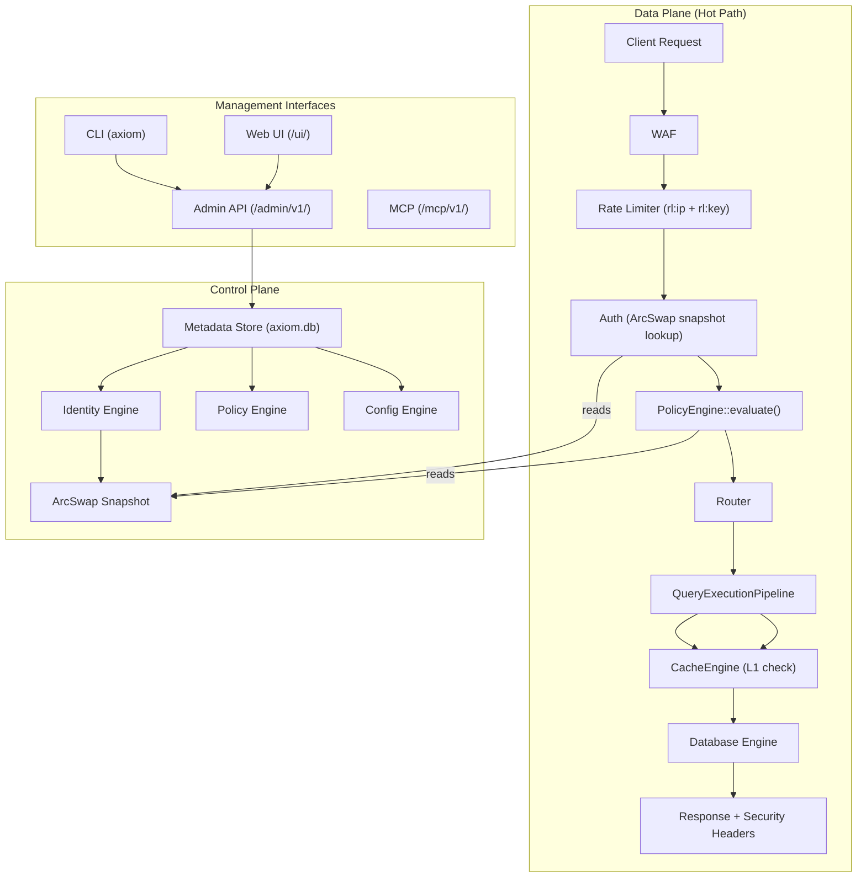
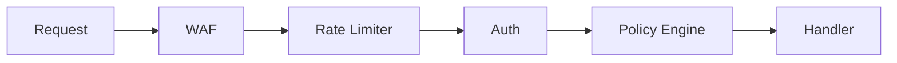

# AXIOM MASTER PLAN — Enterprise-Grade Re-Architecture

**Version:** 4.0  
**Status:** Active  
**Updated:** 2026-09-27  
**Branch:** `feature_1`

This document is the single source of truth for the Axiom v4.0 redesign. Update it whenever implementation diverges from the plan. Do not allow the codebase and this document to drift apart.

---

## Section 1: Product Vision

Axiom is a single-binary Rust API gateway that sits between applications and SQL databases. It has two seemingly contradictory properties:

**SMALL:** Download binary → run → connect database → API works. Minimal dependencies. Minimal configuration. < 10 MB RAM idle. Fast startup.

**POWERFUL:** Multiple databases, multiple users, roles, policies, API keys, audit, metrics, persistent caching, high concurrency, CLI, Web UI, MCP, automation.

The architecture must allow both without forcing small deployments to pay the cost of enterprise features.

---

## Section 2: Architecture Principles

1. **Measure, don't assume.** Every performance claim needs a reproducible benchmark.
2. **Hot path is sacred.** The request path must allocate as little as possible. Zero DB calls for auth.
3. **Engines are cooperating modules, not microservices.** No inter-process communication.
4. **Control plane / data plane are logically separated** (same process by default).
5. **Optional systems add zero CPU/memory when disabled.**
6. **Server config is immutable at runtime.** Metadata (keys, roles, DBs) is hot-reloadable via ArcSwap.
7. **Security is centralized** — auth + authz in one place (PolicyEngine), not scattered in handlers.
8. **Every error is typed.** No `Box<dyn Error>` on hot paths.
9. **Binary stays small.** Feature-gate heavy optional components.
10. **Compatibility over freshness.** `/api/v1/` must not break without a major version bump.

---

## Section 3: Existing Architecture Audit (v3.0.1)

### Current Request Pipeline



### Architectural Debt Items (fix in Phase 0)

| # | Location | Problem | Impact |
|---|----------|---------|--------|
| 1 | `handlers.rs:68,91` | `ConfigManager::get()` called twice per request in `run_query` | Unnecessary Arc clone on every request |
| 2 | `base.rs:42` | `Box<dyn Error>` return on DB engine trait hot path | Heap allocation per query |
| 3 | `auth.rs:41` + `rate_limit.rs:30` | BanList checked in both middlewares | Redundant DashMap lookup per request |
| 4 | `handlers.rs:66` | `CIRCUIT_FAILURES` static defined inside function body | Incorrect Rust pattern, potential UB |
| 5 | `handlers.rs:48-53` | Cache evicts arbitrary first key, not LRU | Cache pollution, poor hit rates |
| 6 | `schema.rs:208` | `full_admin: bool` hardcoded privilege | Cannot express fine-grained permissions |
| 7 | `handlers.rs:89` | Regex mutation check + AST parse both run on every uncached request | Double CPU cost |
| 8 | `pool.rs:33` | Single global `INIT_LOCK` blocks all DB cold-starts | Head-of-line blocking across databases |
| 9 | `cache.rs` | Three disconnected cache stores, no shared eviction/observability | Memory leaks, no visibility |
| 10 | All handlers | Response shape constructed inline, no shared schema | Inconsistent API responses |

### Confirmed Security Bypasses (fix in Phase 0)

| # | Location | Bypass | Severity | Fix |
|---|----------|--------|----------|-----|
| S1 | `rate_limit.rs:22` | If `trusted_proxies = ["*"]`, attacker spoofs any IP via `X-Forwarded-For` — infinite rate limit bypass | Critical | Warn on startup if `trusted_proxies` contains `"*"`; document that `"*"` must never be used in production |
| S2 | `rate_limit.rs:56` | Rate limit keyed only by IP (`rl:ip:{ip}`). Attacker with one valid API key rotating through multiple IPs gets a fresh bucket each time — key is never throttled | Medium | Add parallel `rl:key:{key_name}` counter; enforce the lower of IP limit and key limit |
| S3 | `rate_limit.rs` | No global auth failure counter per key. Distributed brute-force (1000 IPs each trying 1 wrong guess) never triggers per-IP ban | Medium | Track global failed-auth count per key name; ban key after threshold regardless of source IP |

---

## Section 4: Competitive Research

### Faucet (Go)
Single binary, embedded SQLite config DB, RBAC, MCP, CLI-first, OpenAPI auto-gen.

**Key lessons for Axiom:**
- Embedded config DB (SQLite) enables live reconfiguration without restart — Axiom adopts this via `axiom.db`.
- CLI and Web UI call the same Admin API — no duplicated business logic.
- OpenAPI auto-generation from database schema — consider for Phase 3+ CLI.
- Simple RBAC model: roles → permissions → API keys. Axiom follows the same pattern.

### Hasura
Control/data plane separation, metadata-driven API, permission predicate pushdown.

**Key lessons for Axiom:**
- Compile-once metadata → execute-many pattern. Auth constraints compiled into SQL predicates.
- Schema cache invalidated via PostgreSQL NOTIFY — Axiom uses ArcSwap snapshot refresh instead.
- Relationship modeling between tables — out of scope for Axiom v4 but extension point preserved.

### PostgREST (Haskell)
DB-as-authority, schema cache invalidated via NOTIFY, PostgreSQL binary protocol.

**Key lesson:** Cache the schema, not just queries. Axiom should introspect and cache table schemas to avoid repeated INFORMATION_SCHEMA queries.

### DreamFactory
API gateway with database abstraction, role/permission model, service architecture.

**Key lesson:** Per-table and per-operation permissions are essential for multi-app deployments. Axiom's `permissions` table supports this with `database + table_name + operations` fields.

### Redis
Single-threaded event loop, AOF+RDB persistence, LRU/LFU eviction.

**Key lessons for Axiom:**
- Separate hot-data path from persistence; acknowledge before fsync.
- LRU eviction with configurable maxmemory policy — Axiom L1 adopts this.
- AOF rewrite compaction — Axiom L2 SQLite handles this automatically.
- Do NOT claim faster than Redis without a reproducible benchmark.

---

## Section 5: Target Architecture



---

## Section 5.1: Physical Workspace Structure (Cargo Workspace)

Axiom v4.0 is structured as a Cargo Workspace. Each logical engine is a physically isolated Rust crate. This enforces strict architectural boundaries and enables parallel compilation.

```text
axiom/
├── Cargo.toml (Workspace Root)
├── crates/
│   ├── core/         # Shared traits, Error enums, common types (AxiomError, QueryResult, ColumnInfo)
│   ├── metadata/     # libsql identity store (axiom.db), ArcSwap<Metadata> snapshots, auto-seed from config.toml
│   ├── policy/       # RBAC evaluation engine (PolicyEngine::evaluate), depends on metadata
│   ├── cache/        # Unified L1/L2 cache engine (DashMap + AOF SQLite), LRU eviction, TTL sweep
│   ├── db/           # Connection pooling (per-alias locks), SQL engine implementations (PG, MySQL, MSSQL, LibSQL, ClickHouse)
│   └── api/          # Axum HTTP routes, middleware pipeline (WAF, rate_limit, auth), Web UI embedding (rust-embed)
├── binaries/
│   ├── server/       # Main daemon binary (axiom-server). Glues crates together, starts TCP listener.
│   └── cli/          # CLI binary (axiom). Subcommands for key|db|user|cache|health|bench.
├── ui/               # Vite + TypeScript + Tailwind CSS. Pre-built bundle embedded in server binary.
├── benches/          # Native Rust Criterion benchmark suite (benches/benches/pipeline.rs)
├── tests/            # Integration and security test suites
├── docs/             # Public-facing reference documentation
└── v4-planning/      # Architecture blueprints (this folder)
```

**Dependency rule:** Higher-level crates (like `api`) can depend on lower-level crates (like `cache`, `policy`), but never the reverse.

---

## Section 6: Core Engines

| Engine | Crate | Responsibility |
|--------|-------|----------------|
| **API Engine** | `crates/api` | Axum router, middleware pipeline, request/response serialization, Web UI embedding |
| **Router Engine** | `crates/api` (submodule) | URL matching, versioned route registration (`/api/v1/`, `/admin/v1/`, `/mcp/v1/`) |
| **Request Pipeline** | `crates/api` | Ordered middleware chain: WAF → Rate Limit → Auth → Policy → Handler |
| **Authentication Engine** | `crates/api` (middleware) | X-Axiom-Key extraction, base64 decode, BLAKE3 hash comparison against ArcSwap snapshot |
| **Authorization / Policy Engine** | `crates/policy` | `PolicyEngine::evaluate(key, database, table, operation) → Allow/Deny`. Reads ArcSwap snapshot. |
| **Security Engine** | `crates/api` (middleware) | WAF (URI length, null-byte, path traversal 3x decode), security headers, CORS, body limits |
| **Rate Limit Engine** | `crates/api` (middleware) | Per-IP (`rl:ip:{ip}`) + per-key (`rl:key:{name}`) fixed-window counters via CacheEngine |
| **Cache Engine** | `crates/cache` | Unified L1 (DashMap LRU) + L2 (SQLite AOF). Handles query cache, rate limit counters, idempotency keys. |
| **Database Engine** | `crates/db` | Connection pool management, SQL engine trait, dialect-specific implementations |
| **Connection Pool Engine** | `crates/db` (submodule) | Per-alias connection pools with per-alias init locks. DashMap<String, Arc<dyn DatabaseEngine>>. |
| **Query Engine** | `crates/db` (submodule) | SQL AST validation (sqlparser), query blacklist enforcement, mutation detection, timeout enforcement |
| **Serialization Engine** | `crates/core` | Shared response envelope, NaN-safe float serialization, typed QueryResult |
| **Logging Engine** | `crates/core` (tracing) | Structured JSON/pretty logs, async file rotation, secret redaction |
| **Metrics / Observability Engine** | `crates/api` | Prometheus `/metrics` endpoint, request counters, cache stats, pool stats, latency histograms |
| **Configuration Engine** | `crates/core` | `figment` TOML + env loading, startup-only config, `OnceLock<Arc<AxiomConfig>>` |
| **Secrets Engine** | `crates/metadata` | BLAKE3 hashing for API key secrets, Argon2 for admin passwords. Never stores plaintext. |
| **Audit Engine** | `crates/metadata` | Structured audit log for all control plane mutations (key created, role modified, DB added). |
| **Metadata Engine** | `crates/metadata` | libsql read/write to `axiom.db`, ArcSwap snapshot publication, config.toml auto-seeding. |
| **CLI Engine** | `binaries/cli` | `clap`-based subcommand tree. Calls Admin API over HTTP. |
| **Admin/Web UI** | `ui/` + `crates/api` | Vite+TS+Tailwind pre-built, embedded via rust-embed, served at `/ui/`. |
| **MCP Engine** | `crates/api` (routes) | `/mcp/v1` endpoint for AI agent access. Same RBAC policy enforcement as data API. |
| **Federation Engine** | Not implemented | Extension points left in API and DB engines for future cross-node query routing. |
| **Testing / Benchmark Engine** | `benches/` + `tests/` | Go benchmark suites, Rust integration tests, security fuzzing. |

---

## Section 7: API Specification

### URL Map

```text
Data API (v1 — preserved, not breaking):
  POST   /api/v1/db/:alias/query         # Raw SQL query
  GET    /api/v1/db/:alias/tables         # List tables
  GET    /api/v1/db/:alias/:table/rows    # Fetch rows (cursor, limit, sort, order, filter)
  POST   /api/v1/db/:alias/:table/rows    # Insert rows
  PATCH  /api/v1/db/:alias/:table/rows    # Update rows (filter required)
  DELETE /api/v1/db/:alias/:table/rows    # Delete rows (filter required)
  GET    /api/v1/db/:alias/:table/schema  # Describe table columns and foreign keys
  GET    /api/v1/db/databases             # List all configured databases

Admin API (requires admin user session):
  GET    /admin/v1/status                 # System status
  POST   /admin/v1/reload                 # Force ArcSwap snapshot refresh
  GET    /admin/v1/keys                   # List API keys
  POST   /admin/v1/keys                   # Create API key
  POST   /admin/v1/keys/:name/rotate      # Rotate API key secret
  DELETE /admin/v1/keys/:name             # Delete API key
  GET    /admin/v1/roles                  # List roles
  POST   /admin/v1/roles                  # Create role with permissions
  PATCH  /admin/v1/roles/:name            # Update role permissions
  DELETE /admin/v1/roles/:name            # Delete role
  GET    /admin/v1/databases              # List database connections
  POST   /admin/v1/databases              # Add database connection
  GET    /admin/v1/databases/:alias/test  # Test connection & probe dialect
  DELETE /admin/v1/databases/:alias       # Remove database connection
  GET    /admin/v1/audit                  # Query audit log
  POST   /admin/v1/cache/flush            # Flush all caches
  GET    /admin/v1/cache/stats            # Cache hit/miss/memory stats
  GET    /admin/v1/metrics                # Prometheus-format metrics
  GET    /admin/v1/health                 # Detailed health (admin only)

Setup API (only works when axiom.db is empty):
  POST   /admin/v1/setup/begin            # Validate setup not done, return session
  POST   /admin/v1/setup/account          # Create first admin user
  POST   /admin/v1/setup/database         # Add first DB (optional, skip OK)
  POST   /admin/v1/setup/complete         # Mark setup done, lock /setup permanently

MCP (Phase 4):
  POST   /mcp/v1                          # Model Context Protocol endpoint

Web UI:
  GET    /ui/*                            # Embedded SPA
  GET    /ui/setup                        # First-time setup wizard

Core:
  GET    /health                          # Basic health (public)
  GET    /ready                           # Readiness probe
  GET    /metrics                         # Prometheus metrics (optional)
```

### Response Envelope

All API responses use a consistent envelope:

```json
{
  "success": true,
  "data": { ... },
  "meta": {
    "request_id": "550e8400-e29b-41d4-a716-446655440000",
    "duration_ms": 1.23,
    "cached": false
  },
  "error": null
}
```

Error responses:

```json
{
  "success": false,
  "data": null,
  "meta": { "request_id": "..." },
  "error": {
    "code": "RATE_LIMIT_EXCEEDED",
    "message": "Rate limit exceeded or IP temporarily blocked."
  }
}
```

### Query Parameters (GET /rows)

| Parameter | Type | Description |
|-----------|------|-------------|
| `cursor` | integer | Offset for pagination |
| `limit` | integer | Max rows to return (default 100, max 10000) |
| `sort` | string | Column name to sort by |
| `order` | string | `asc` or `desc` |
| `filter` | JSON | Filter object: `{"column": {"op": "value"}}` |

### Filter Operators

| Operator | SQL | Example |
|----------|-----|---------|
| `eq` | `=` | `{"status": {"eq": "active"}}` |
| `neq` | `!=` | `{"status": {"neq": "deleted"}}` |
| `gt` | `>` | `{"age": {"gt": 18}}` |
| `gte` | `>=` | `{"age": {"gte": 18}}` |
| `lt` | `<` | `{"price": {"lt": 100}}` |
| `lte` | `<=` | `{"price": {"lte": 100}}` |
| `like` | `LIKE` | `{"name": {"like": "%john%"}}` |
| `in` | `IN` | `{"id": {"in": [1, 2, 3]}}` |
| `is_null` | `IS NULL` | `{"deleted_at": {"is_null": true}}` |

---

## Section 8: Identity and RBAC Model

A strict separation exists between **Human Admins** (who manage the system) and **API Keys** (which access data).

### Human Admins (`users` table)
- Used ONLY for logging into the Web UI.
- Admins have no "roles". An admin owns and manages the entire system.
- **Creation rule:** The first admin account is created via the `/ui/setup` wizard on first boot. After setup is complete, additional admins can ONLY be created via the CLI (`axiom user add <username>`), preventing Web UI backdoor creation.

### API Keys & Roles (`api_keys`, `roles`, `permissions`)
- Used by external applications to access the data API.
- Admins use the Web UI or CLI to create custom Roles that restrict what an API key can do.
- There are no built-in roles. Every role is operator-defined.

### Database Schema

```sql
-- Human Admins (Web UI login)
CREATE TABLE users (
    id INTEGER PRIMARY KEY,
    username TEXT UNIQUE NOT NULL,
    password_hash TEXT NOT NULL  -- Argon2
);

-- Machine API Keys (Data API access)
CREATE TABLE roles (
    name TEXT PRIMARY KEY,
    description TEXT,
    created_at INTEGER NOT NULL
);

CREATE TABLE permissions (
    id INTEGER PRIMARY KEY AUTOINCREMENT,
    role_name TEXT NOT NULL REFERENCES roles(name),
    database TEXT NOT NULL,    -- '*' = all databases
    table_name TEXT NOT NULL,  -- '*' = all tables
    operations TEXT NOT NULL   -- JSON array: ["SELECT","INSERT","UPDATE","DELETE"]
);

CREATE TABLE api_keys (
    name TEXT PRIMARY KEY,
    secret_hash BLOB NOT NULL,  -- BLAKE3(secret), never plaintext
    role_name TEXT REFERENCES roles(name),
    rate_limit INTEGER,         -- Per-key override, 0 = use global
    expires_at INTEGER,         -- Unix timestamp, NULL = never
    created_at INTEGER NOT NULL
);
```

### Auth Flow (Data API)

```
X-Axiom-Key header received
  → base64 decode → "name:secret"
  → lookup api_keys by name in ArcSwap<Metadata> snapshot (zero DB calls)
  → BLAKE3(secret) == stored_hash? (constant-time comparison)
  → load that key's role → load role's permissions
  → PolicyEngine::evaluate(database, table, operation)
  → allowed? → inject AuthContext into request → continue
  → denied? → 403 Forbidden
```

### Backward Compatibility
`[api_key.*]` and `[database.*]` blocks in config.toml continue to work. On first boot, these entries are seeded into `axiom.db`. A key with `full_admin = true` in config.toml gets its seeded role initialized with permissions covering all databases and all operations.

---

## Section 9: Security Architecture

### Security Pipeline (per request)



### WAF Layer (`crates/api/middleware/waf.rs`)
- URI length check (max 2048 chars)
- Null-byte rejection (`%00`)
- Path traversal detection with 3x URL decode to catch `%252e%252e` bypass
- Request body size enforced by `DefaultBodyLimit::max(10 * 1024 * 1024)` (10 MB)

### Rate Limiting (`crates/api/middleware/rate_limit.rs`)
- **Per-IP:** `rl:ip:{client_ip}` fixed-window counter
- **Per-Key:** `rl:key:{key_name}` fixed-window counter (NEW in v4)
- Both counters go through the unified CacheEngine
- Penalty system: after N violations, IP is temp-banned
- `allowed_ips` bypass rate limiting entirely (for monitoring/health checks)
- `trusted_proxies` controls which TCP peers are trusted for `X-Forwarded-For`
- **S1 fix:** Log a WARNING on startup if `trusted_proxies` contains `"*"`

### Auth Layer (`crates/api/middleware/auth.rs`)
- Extracts `X-Axiom-Key` header
- Base64 decodes to `name:secret`
- Looks up key in `ArcSwap<Metadata>` snapshot (zero locks, zero DB calls)
- BLAKE3 hash of provided secret compared to stored hash (constant-time)
- **S3 fix:** Tracks failed auth attempts per key name globally. After threshold, bans the key regardless of source IP.
- On success: injects `AuthContext { key_name, role, permissions }` into request extensions

### Security Headers (every response)

| Header | Value |
|--------|-------|
| `X-Request-ID` | UUID v4 per request |
| `X-Content-Type-Options` | `nosniff` |
| `X-Frame-Options` | `DENY` |
| `Strict-Transport-Security` | `max-age=63072000; includeSubDomains; preload` |
| `Content-Security-Policy` | `default-src 'none'; frame-ancestors 'none';` |

### Attack Protection Matrix

| Attack | Protection | Layer |
|--------|-----------|-------|
| SQL injection via API | AST parser (sqlparser) + query blacklist | Handler |
| SQL injection via URL | WAF path traversal + null-byte filter | WAF |
| Brute-force auth (single IP) | Per-IP rate limit + auto-ban after N failures | Rate Limit |
| Brute-force auth (distributed) | Per-key global failure counter + key ban | Auth |
| X-Forwarded-For spoofing | Only trust if TCP peer is in `trusted_proxies` | Rate Limit |
| DDoS (volumetric) | Out of scope — handled by Cloudflare/CDN | External |
| Path traversal | 3x URL decode before checking for `..` | WAF |
| Oversized requests | 10 MB body limit | WAF |
| NaN/Infinity serialization crash | NaN-safe float serialization | Serialization |
| Timing attack on auth | BLAKE3 constant-time comparison | Auth |

---

## Section 10: Cache Architecture

The v4 Cache Engine replaces the three disconnected cache stores in v3 with a single unified system.

### Two-Tier Design

| Tier | Implementation | Latency | Persistence |
|------|---------------|---------|-------------|
| **L1** | DashMap (RAM) | < 1 µs | None (volatile) |
| **L2** | SQLite (disk) | ~ 50 µs | Yes (survives restart) |

### Operations Flow

```
CacheEngine::get(key)
  → Check L1 (DashMap)
    → Hit? Return immediately.
    → Miss? Check L2 (SQLite)
      → Hit? Promote to L1, return.
      → Miss? Return None.

CacheEngine::set(key, value, ttl)
  → Write to L1
  → If journaled mode: async append to L2
```

### Eviction
- L1: True LRU eviction. Each entry tracks last-access timestamp. When L1 exceeds `max_entries`, evict least-recently-used.
- L2: TTL-based expiry only. Background sweep every 60s.

### TTL Sweep
Background task uses a `BinaryHeap<(expiry_time, key)>` min-heap. Every tick, pops all entries where `expiry_time <= now()` and deletes them from L1 and L2.

### Durability Levels

| Level | L1 | L2 | Use Case |
|-------|----|----|----------|
| `ephemeral` | Yes | No | Rate limit counters, temp data |
| `memory-only` | Yes | No | Query result cache |
| `journaled` | Yes | Yes (AOF) | Idempotency keys |
| `snapshot` | Yes | Yes (periodic) | Long-lived cache |
| `journaled+snapshot` | Yes | Yes (both) | Maximum durability |

### What Goes Through the Cache Engine

| Data | TTL | Durability | Notes |
|------|-----|------------|-------|
| Rate limit counters (`rl:ip:*`, `rl:key:*`) | Window size (e.g. 60s) | ephemeral | Lost on restart is OK |
| Query result cache | `query_results_ttl` (default 5s) | memory-only | Hot query optimization |
| Idempotency keys | `idempotency_ttl` (default 24h) | journaled | Must survive restart |
| Schema cache | 300s | memory-only | Avoids repeated INFORMATION_SCHEMA queries |

### Cache Stampede Protection
When L1 misses and L2 misses, only one task fetches from the database. Other concurrent requests for the same key wait on a `tokio::sync::broadcast` channel. This prevents N identical queries from hitting the database simultaneously.

### Observability
All stats exposed via `/admin/v1/cache/stats` and Prometheus `/metrics`:
- `axiom_cache_hits_total` (counter, labels: tier=l1|l2)
- `axiom_cache_misses_total` (counter)
- `axiom_cache_evictions_total` (counter)
- `axiom_cache_entries` (gauge)
- `axiom_cache_memory_bytes` (gauge, approximate)

---

## Section 11: Database Architecture

### Supported Engines

| Engine | Crate | URL Prefix |
|--------|-------|------------|
| PostgreSQL | `sqlx` | `postgres://`, `postgresql://` |
| MySQL | `sqlx` | `mysql://` |
| MariaDB | `sqlx` | `mariadb://` |
| MSSQL | `tiberius` | `mssql://`, `sqlserver://` |
| SQLite / LibSQL | `libsql` | `sqlite://`, `libsql://` |
| ClickHouse | `reqwest` (HTTP) | `clickhouse://`, `clickhouse+https://` |

### DatabaseEngine Trait

```rust
pub trait DatabaseEngine: Send + Sync {
    async fn connect(url: &str) -> Result<Self, EngineError>;
    async fn disconnect(&self) -> Result<(), EngineError>;
    async fn health_check(&self) -> Result<(), EngineError>;
    async fn list_tables(&self, cursor: i64, limit: i64) -> Result<Vec<TableInfo>, EngineError>;
    async fn count_tables(&self) -> Result<i64, EngineError>;
    async fn describe_table(&self, table: &str) -> Result<Vec<ColumnInfo>, EngineError>;
    async fn get_foreign_keys(&self, table: &str) -> Result<Vec<ForeignKeyInfo>, EngineError>;
    async fn execute(&self, sql: &str, params: &[Value]) -> Result<QueryResult, EngineError>;
    fn dialect(&self) -> &str;
}
```

Note: Returns `EngineError` (typed enum), NOT `Box<dyn Error>` (fixing debt item #2).

### Connection Pool
- `ENGINES: DashMap<String, Arc<dyn DatabaseEngine>>` stores live connections
- **Per-alias init lock** (fixing debt item #8): `INIT_LOCKS: DashMap<String, Arc<Mutex<()>>>` — connecting to `main_db` does not block `analytics_db` from connecting
- Lazy connect on first request to that alias
- Health check runs on interval per pool

### Circuit Breaker
- Per-alias failure counter (NOT inside function body — fixing debt item #4)
- After `failure_threshold` consecutive failures: circuit OPEN, reject all requests to that alias with 503
- After `timeout` seconds: circuit HALF-OPEN, allow one probe request
- After `success_threshold` successes in HALF-OPEN: circuit CLOSED

---

## Section 12: Logging and Observability Architecture

### Structured Logging
- Format: JSON (production) or pretty (development), configured via `[logging] format`
- Every log entry includes: `timestamp`, `level`, `request_id`, `message`
- Query logs additionally include: `database`, `key_name`, `query` (first 200 chars), `rows_affected`, `duration_ms`
- Async file writer with rotation: `max_file_size` and `max_files` from config
- Log guard kept alive in `main()` to guarantee flush on shutdown

### Secret Redaction
The following are NEVER logged:
- API key secrets
- Database connection URLs (password portion)
- `X-Axiom-Key` header values
- User passwords

### Audit Log
All control plane mutations are logged to an `audit_log` table in `axiom.db`:

| Field | Type | Description |
|-------|------|-------------|
| `id` | INTEGER | Auto-increment |
| `timestamp` | INTEGER | Unix timestamp |
| `actor` | TEXT | Admin username or "system" |
| `action` | TEXT | `key.created`, `role.deleted`, `db.added`, etc. |
| `target` | TEXT | Resource identifier |
| `details` | TEXT | JSON with before/after state |

### Prometheus Metrics (`/metrics`)

| Metric | Type | Labels |
|--------|------|--------|
| `axiom_http_requests_total` | counter | method, path, status |
| `axiom_http_request_duration_seconds` | histogram | method, path |
| `axiom_db_queries_total` | counter | alias, operation |
| `axiom_db_query_duration_seconds` | histogram | alias |
| `axiom_db_pool_connections_active` | gauge | alias |
| `axiom_cache_hits_total` | counter | tier |
| `axiom_cache_misses_total` | counter | — |
| `axiom_auth_failures_total` | counter | reason |
| `axiom_rate_limit_rejections_total` | counter | — |

---

## Section 13: Configuration Architecture

### Hierarchy (highest wins)

```
Defaults (compiled into binary)
  ↓
config.toml (read once at startup)
  ↓
Environment variables (SERVER__PORT=4500)
  ↓
CLI flags (--port 4500)
```

### Classification

| Setting | Category | Where |
|---------|----------|-------|
| `server.host`, `server.port` | Startup-only | config.toml |
| `server.workers` | Startup-only | config.toml |
| `logging.level`, `logging.format` | Startup-only | config.toml |
| `metadata.url`, `metadata.token` | Startup-only | config.toml |
| `rate_limit.*` | Startup-only | config.toml |
| `cache.*` | Startup-only | config.toml |
| `circuit_breaker.*` | Startup-only | config.toml |
| API keys | Runtime-mutable | axiom.db (via Admin API / Web UI) |
| Database connections | Runtime-mutable | axiom.db (via Admin API / Web UI) |
| Roles and permissions | Runtime-mutable | axiom.db (via Admin API / Web UI) |
| Admin users | Runtime-mutable | axiom.db (via CLI only) |

---

## Section 14: CLI Architecture

### Subcommand Tree

```text
axiom
├── server
│   └── run              # Start the Axiom server
├── user
│   ├── add <username>   # Create admin user (interactive password prompt)
│   ├── list             # List admin users
│   └── delete <username>
├── key
│   ├── create           # Create API key (--name, --role, --secret or auto-generate)
│   ├── list             # List all API keys
│   ├── rotate <name>    # Rotate secret for a key
│   └── delete <name>
├── role
│   ├── create           # Create role (--name, --permissions JSON)
│   ├── list
│   ├── update <name>    # Modify permissions
│   └── delete <name>
├── db
│   ├── add              # Add database (--alias, --url, --engine)
│   ├── list
│   ├── test <alias>     # Test connection
│   └── remove <alias>
├── cache
│   ├── stats            # Show hit/miss/memory stats
│   └── flush            # Flush all caches
├── health               # Check server health
├── metrics              # Dump Prometheus metrics
├── benchmark            # Run built-in benchmark suite
└── doctor               # Diagnose common issues (port in use, DB unreachable, etc.)
```

### Output Formats

| Flag | Format | Use |
|------|--------|-----|
| (default) | Human-readable table | Interactive terminal |
| `--json` | JSON | Scripts and automation |
| `--jsonl` | JSON Lines | Streaming/piping |

All CLI commands call the Admin API over HTTP (`http://localhost:{port}/admin/v1/...`). The CLI and Web UI share the same backend.

---

## Section 15: Web UI Architecture

### Stack
- **Vite + TypeScript + Tailwind CSS** (no framework runtime like React/Vue)
- Pre-built bundle embedded in the `axiom-server` binary via `rust-embed`
- Served at `/ui/`
- Target bundle size: < 200 KB gzipped

### Setup Wizard (`/ui/setup`)

Shown only on first boot when `axiom.db` has no users.

| Step | Screen | API Call |
|------|--------|----------|
| 1 | Welcome (explains what Axiom does) | None |
| 2 | Create Admin Account (username + password) | `POST /admin/v1/setup/account` |
| 3 | Connect Database (alias, engine dropdown, URL, test button) — skippable | `POST /admin/v1/setup/database` |
| 4 | Done (shows API token, curl example) | `POST /admin/v1/setup/complete` |

After `/setup/complete` is called, the `/ui/setup` route permanently redirects to `/ui/login`.

### Login (`/ui/login`)
Username + password form. On success, the Web UI gets a session cookie (HttpOnly, Secure, SameSite=Strict). The session is stored server-side in `axiom.db`.

### Pages

| Page | Description |
|------|-------------|
| Overview | Total requests, active DBs, cache hit rate, uptime |
| Databases | List, add, remove, test connections |
| API Keys | List, create, rotate, delete keys |
| Roles | List, create, edit permissions (database + table + operations checkboxes) |
| Cache | Hit/miss stats, memory usage, flush button |
| Logs | Live-tail structured logs with filters |
| Audit | Control plane change history |
| Metrics | Key Prometheus metrics visualized |
| System | Server info, config dump, version |

### Design System

Vercel + Cloudflare inspired. Dark mode only.

| Token | Value | Role |
|-------|-------|------|
| `bg-background` | `#1F1F1F` | App background |
| `bg-surface` | `#454545` | Card/surface |
| `text-primary` | `#F5F5F5` | Main text |
| `text-secondary` | `#A1A1A1` | Helper text |
| `border-default` | `#858585` | Borders |
| `accent-primary` | `#F6821F` | Orange accent |
| `accent-secondary` | `#4693FF` | Blue accent |
| `accent-danger` | `#AE292F` | Destructive actions |
| `border-focus` | `#F59E0B` | Focus rings |

Font: GeistSans / Inter. Radii: 4px (inputs), 6px (cards). No decorative shadows on data tables.

---

## Section 16: Federation Architecture

Out of scope for v4.0.

Extension points will be left in the API Engine (route registration) and DB Engine (cross-node query forwarding) so that federation can be added in v5 without restructuring.

Federation would involve multiple Axiom nodes sharing a remote Turso metadata store and routing queries to the node that owns the target database.

---

## Section 17: MCP Architecture

Phase 4 implements the `/mcp/v1` endpoint conforming to the **Model Context Protocol (JSON-RPC 2.0)** specification. It allows autonomous AI agents (such as Claude Desktop, Cursor, or custom LLM orchestrators) to safely discover, inspect, and manipulate databases connected to Axiom.

### 17.1 Protocol Specification & Transport
- **Endpoint:** `POST /mcp/v1`
- **Transport:** JSON-RPC 2.0 over HTTP (stateless request/response)
- **Authentication:** Standard `X-Axiom-Key: base64(name:secret)` header.
- **Authorization:** Every tool execution passes through `PolicyEngine::evaluate(database, table, operation)` against the caller's active metadata snapshot.

### 17.2 Supported MCP Protocol Methods

| JSON-RPC Method | Purpose | Implementation Notes |
|---|---|---|
| `initialize` | Client handshake | Returns server metadata (`"axiom"`), protocol version, and server capabilities. |
| `tools/list` | Tool discovery | Returns schemas for all 8 database tools. Filtered by the API key's RBAC scope. |
| `tools/call` | Tool execution | Dispatches tool call to data plane engines; enforces AST validation and RBAC. |
| `resources/list` | Context discovery | Exposes database schemas as URI resources (`axiom://{database}/schema`). |
| `resources/read` | Context retrieval | Returns formatted table and column schemas for immediate LLM context loading. |

### 17.3 The 8-Tool Database Suite

To optimize for LLM reliability and eliminate SQL syntax hallucinations, the MCP engine provides both structured (dialect-agnostic) tools and raw SQL access:

| Tool Name | Operation | Input Parameters | Description & Guardrails |
|---|---|---|---|
| **`list_services`** *(alias `list_databases`)* | Discovery | *(none)* | Enumerates all database aliases configured in Axiom that the caller's API key is authorized to access. |
| **`list_tables`** | Discovery | `database: string`<br>`cursor?: int`<br>`limit?: int` | Lists all tables in the specified database. Filtered by table-level permissions. |
| **`describe_table`** | Discovery | `database: string`<br>`table: string` | Returns column names, data types, nullability, primary keys, and foreign key relationships. |
| **`query`** | Structured Read | `database: string`<br>`table: string`<br>`filter?: object`<br>`sort?: string`<br>`order?: "asc"\|"desc"`<br>`limit?: int`<br>`cursor?: int` | Executes a structured, parameterized SELECT using Axiom's `filter_builder`. Eliminates SQL dialect quirks (Postgres `$1` vs MySQL `?` vs MSSQL `@P1`). Requires `SELECT` permission. |
| **`insert`** | Structured Write | `database: string`<br>`table: string`<br>`rows: object[]` | Inserts one or more rows into the table. Parameters are strictly bound. Requires `INSERT` permission. |
| **`update`** | Structured Write | `database: string`<br>`table: string`<br>`filter: object`<br>`data: object` | Updates rows matching the filter criteria. **Mandatory filter:** rejects unconstrained updates to prevent accidental full-table modification. Requires `UPDATE` permission. |
| **`delete`** | Structured Write | `database: string`<br>`table: string`<br>`filter: object` | Deletes rows matching the filter criteria. **Mandatory filter:** rejects unconstrained deletes to prevent catastrophic accidental data loss. Requires `DELETE` permission. |
| **`raw_sql`** | Raw SQL Execution | `database: string`<br>`sql: string`<br>`params?: any[]` | Executes arbitrary SQL for complex joins, aggregations, and CTEs. Inspected by SQL AST firewall (rejects blacklisted queries and multiple statements). Requires appropriate RBAC operations. |

### 17.4 Structured Tools vs. Raw SQL Rationale

1. **Dialect Hallucination Resistance:** LLMs frequently produce syntax errors when switching between Postgres, MySQL, MSSQL, ClickHouse, and LibSQL. The structured tools (`query`, `insert`, `update`, `delete`) accept clean JSON payloads and delegate dialect-specific SQL generation to Axiom's internal query builder.
2. **Granular Operator Guardrails:** Operators can define roles that grant access to structured CRUD tools (`query`, `insert`) while **disabling `raw_sql` completely**. This eliminates SQL injection risks and prevents agents from executing DDL (`DROP`, `ALTER`, `TRUNCATE`) or expensive table scans.
3. **Mandatory Safety Filters:** AI agents executing destructive operations are prevented from making catastrophic mistakes; `update` and `delete` strictly require a non-empty `filter` block.
4. **Code Reuse:** Structured tools map 1:1 to Axiom's existing `/api/v1/db/:alias/:table/rows` handlers, while `raw_sql` maps to `/api/v1/db/:alias/query`. No database logic is duplicated.

### 17.5 JSON-RPC Request & Response Examples

#### Tool Call: `tools/call` (`query`)
```json
{
  "jsonrpc": "2.0",
  "id": 1,
  "method": "tools/call",
  "params": {
    "name": "query",
    "arguments": {
      "database": "main_db",
      "table": "users",
      "filter": { "status": { "eq": "active" } },
      "limit": 10
    }
  }
}
```

#### Response Envelope:
```json
{
  "jsonrpc": "2.0",
  "id": 1,
  "result": {
    "content": [
      {
        "type": "text",
        "text": "{\"rows\": [{\"id\": 1, \"name\": \"Alice\", \"status\": \"active\"}], \"meta\": {\"rows_returned\": 1, \"duration_ms\": 0.84}}"
      }
    ]
  }
}
```

---

## Section 18: Scaling Strategy

```
Single node (default)
  → Everything in one process, one binary, one axiom.db file
  → Suitable for: shared hosting, VPS, development

Multiple stateless API nodes
  → All nodes point [metadata] url to a shared remote Turso DB
  → ArcSwap snapshot keeps each node's auth/policy data fresh (30s refresh)
  → Suitable for: production clusters behind a load balancer

Distributed cache (future)
  → Gossip-based cache invalidation between nodes
  → Not in v4 scope
```

---

## Section 19: Resource Profiles

| Profile | Workers | Cache | Metrics | Web UI | Audit | Target Idle RSS |
|---------|---------|-------|---------|--------|-------|-----------------|
| `minimal` | 1 | off | off | off | off | < 10 MB |
| `standard` | auto | memory L1 | basic counters | on | on | < 30 MB |
| `production` | auto | memory L1 + disk L2 | full Prometheus | on | on | < 50 MB |
| `enterprise` | auto | L1 + L2 + snapshot | full + OpenTelemetry | on | on | configurable |

---

## Section 20: Performance Targets

> **These are engineering targets. No target ships to public documentation without a linked benchmark result.**

| Metric | Target | Test |
|--------|--------|------|
| Cache GET (L1, hot) | < 1 µs p50 | Criterion `cache/l1_get_hot` |
| Auth (warm snapshot) | < 5 µs | Criterion `auth_validate_api_key_snapshot` |
| Filter WHERE clause build | < 2 µs | Criterion `filter_build_where_clause` |
| Full pipeline, cache hit | < 500 µs p50 | Criterion `http_pipeline/get_ready_endpoint` |
| Full pipeline, local DB query | < 2 ms p50 | `axiom benchmark` / direct query |
| Binary size (stripped) | < 15 MB | `cargo build --release` |
| Cold start to first 200 OK | < 200 ms | Process timing |
| Idle RSS (minimal profile) | < 10 MB | `ps -o rss`, 60s idle |
| Idle RSS (standard profile) | < 30 MB | `ps -o rss`, 60s idle |

---

## Section 21: Benchmark Methodology

### What to Record for Every Benchmark

| Field | Example |
|-------|---------|
| Git commit | `3c64779` |
| Axiom version | `4.0.0` |
| Rust compiler | `rustc 1.79.0` |
| CPU | `AMD Ryzen 5 3600, 6C/12T` |
| RAM | `16 GB DDR4` |
| OS | `Ubuntu 22.04 LTS` |
| Configuration | `workers=4, cache=memory, profile=standard` |
| Dataset | `1000 rows, 10 columns, mixed types` |
| Concurrency | `200 goroutines / threads` |
| Duration / Requests | `5000 requests` |

### Benchmark Suites

| Suite | File / Runner | What it measures |
|-------|---------------|------------------|
| HTTP pipeline probe | `axiom benchmark` (CLI) | Sequential round-trip latency & throughput to `/health` |
| HTTP pipeline | `benches/benches/pipeline.rs` | Tower service round-trip latency (`get_ready_endpoint`) |
| Filter generation | `benches/benches/pipeline.rs` | `build_where_clause` AST parameterization overhead |
| Cache operations | `benches/benches/pipeline.rs` | L1 GET / SET throughput via DashMap (`l1_get_hot`, `l1_set_memory_only`) |
| Auth snapshot | `benches/benches/pipeline.rs` | ArcSwap snapshot lookup + BLAKE3 verification (`auth_validate_api_key_snapshot`) |

### Comparison Targets

| System | Workload |
|--------|----------|
| Axiom v3.0.1 | Same bench suite (regression detection) |
| Axiom v4.0 | Baseline |
| Raw direct DB query | Measures Axiom's overhead |
| Faucet (if comparable) | Feature-equivalent comparison |
| Redis (cache workloads) | L1 cache vs Redis GET/SET |

### Output Format
All benchmarks produce JSON output with:
```json
{
  "suite": "bench_db",
  "timestamp": "2026-09-27T03:00:00Z",
  "git_commit": "3c64779",
  "total_requests": 5000,
  "successful": 5000,
  "failed": 0,
  "duration_seconds": 3.12,
  "requests_per_second": 1602.56,
  "latency_p50_ms": 1.23,
  "latency_p95_ms": 2.45,
  "latency_p99_ms": 4.12
}
```

---

## Section 22: Security Test Environment

Automated security tests that run in CI. Every test must have a clear PASS/FAIL condition.

| Category | Test | Expected Result |
|----------|------|-----------------|
| Auth bypass | Request with no `X-Axiom-Key` header | 401 Unauthorized |
| Auth bypass | Request with invalid base64 | 401 Unauthorized |
| Auth bypass | Request with valid format but wrong secret | 401 Unauthorized |
| Auth bypass | Request with expired key | 401 Unauthorized |
| Authz bypass | Key with `SELECT` only tries `INSERT` | 403 Forbidden |
| Authz bypass | Key scoped to `db_a` tries `db_b` | 403 Forbidden |
| Privilege escalation | Non-admin key calls `/admin/v1/keys` | 403 Forbidden |
| SQL injection | `'; DROP TABLE users; --` in filter value | Rejected by AST parser |
| SQL injection | SQL in URL path parameter | Rejected by WAF |
| Path traversal | `/../../../etc/passwd` in URL | Rejected by WAF |
| Path traversal | `%252e%252e%252f` (double-encoded) | Rejected by WAF (3x decode) |
| Brute force (single IP) | 100 wrong passwords from 1 IP | IP banned after threshold |
| Brute force (distributed) | 1 wrong password each from 100 IPs, same key | Key banned after global threshold |
| Rate limit bypass | Spoofed `X-Forwarded-For` from non-trusted proxy | Real TCP IP is rate-limited |
| Oversized request | 20 MB POST body | 413 Payload Too Large |
| Malformed JSON | `{invalid json` in request body | 400 Bad Request |
| Null byte | `%00` in URL | Rejected by WAF |
| Cache poisoning | Two keys, different permissions, same query | Each gets their own cache entry (keyed by key_name + query) |
| Replay | Same `Idempotency-Key` sent twice | Second request returns cached response |

---

## Section 23: Failure and Recovery Strategy

| Subsystem | Failure Scenario | Policy |
|-----------|-----------------|--------|
| Metadata Store (axiom.db) | Connection lost / file corrupted | Serve from last ArcSwap snapshot. Log ERROR. Retry connection every 30s. |
| Cache Engine L1 | Memory pressure | LRU eviction kicks in automatically. No crash. |
| Cache Engine L2 | Disk full / SQLite corrupted | Fallback to L1 only. Log WARNING. Continue serving. |
| Database connection | Connection refused / timeout | Trip circuit breaker. Return 503 for that alias. Other aliases unaffected. |
| Database pool | Pool exhaustion (all connections busy) | Queue request with timeout. Return 503 if timeout exceeded. |
| Config file | Missing or malformed `config.toml` | Fatal exit with clear error message. `process::exit(1)`. |
| Config file | Missing optional sections | Use compiled defaults. |
| Disk full | Log files can't be written | Continue serving. Log to stdout only. |
| Network partition | Can't reach remote Turso metadata | Serve from ArcSwap snapshot (last known good). Retry in background. |
| Process crash | OOM / panic | mimalloc secure mode zeros memory. Panic = abort (release profile). Systemd/Docker restarts. |
| Graceful shutdown | SIGTERM received | Stop accepting new connections. Drain in-flight requests up to `shutdown_timeout`. Flush log guard. Exit 0. |
| Unclean shutdown | SIGKILL / power loss | L2 SQLite journal handles recovery on next startup. axiom.db is crash-safe (SQLite WAL). |

---

## Section 24: Testing Strategy

### Test Categories

| Category | Location | Runner | What it covers |
|----------|----------|--------|----------------|
| Unit tests | `crates/*/src/**/*.rs` | `cargo test` | Core logic: LRU eviction, policy evaluation, filter builder, config parsing |
| Integration tests | `tests/` | `cargo test` | Full HTTP request/response flows with test databases |
| API contract tests | `tests/api/` | `cargo test` | Every endpoint returns correct status codes, headers, and response shape |
| Database compat tests | `tests/db/` | `cargo test` + Docker | Same test suite run against PG, MySQL, SQLite, MSSQL, ClickHouse |
| Security tests | `tests/security/` | `cargo test` | All attacks from Section 22 |
| Load tests | `benches/bench_db.go` | `go run` | Sustained throughput at target concurrency |
| Stress tests | `benches/bench_stress.go` | `go run` | Beyond-capacity load to find breaking points |
| Soak tests | `benches/bench_soak.go` | `go run` | 30-minute steady-state load. Must show zero memory leaks, zero error rate drift. |
| Fuzz tests | `fuzz/` | `cargo fuzz` | Random inputs to WAF, JSON parser, SQL parser, filter builder |
| Property tests | `crates/*/src/**/*.rs` | `proptest` | LRU eviction invariants, policy evaluation completeness |

### Test Environments (Docker Compose)

```yaml
services:
  postgres:
    image: postgres:16
    ports: ["5432:5432"]
  mysql:
    image: mysql:8.0
    ports: ["3306:3306"]
  mssql:
    image: mcr.microsoft.com/mssql/server:2022-latest
    ports: ["1433:1433"]
  clickhouse:
    image: clickhouse/clickhouse-server:latest
    ports: ["8123:8123"]
```

### CI Pipeline

```
git push → cargo fmt --check → cargo clippy → cargo test → docker compose up → integration tests → bench regression check → cargo fuzz (5 min) → docker compose down
```

---

## Section 25: Migration Strategy (v3 → v4)

### Step-by-Step Upgrade Path

1. **Stop Axiom v3.** Back up `config.toml` and any data files.
2. **Replace the binary** with the v4 binary. Same file name, same location.
3. **First boot:** Axiom detects `axiom.db` does not exist.
   - Reads `[api_key.*]` from `config.toml` → seeds into `axiom.db` as API keys with auto-created roles.
   - Reads `[database.*]` from `config.toml` → seeds into `axiom.db` as database connections.
   - A key with `full_admin = true` gets a role with all permissions on all databases.
4. **Open browser** to `http://localhost:4500/ui/setup`.
   - Create your human admin account (username + password).
   - Optionally verify database connections.
   - Complete setup.
5. **Done.** Axiom v4 is now running. API keys and databases are now managed via the Web UI.
6. **Optional cleanup:** Remove `[api_key.*]` and `[database.*]` blocks from `config.toml` (they are only read on first boot).

### What Changes for Existing API Consumers

Nothing. The data API (`/api/v1/*`) response shape, auth header format, and endpoint paths are all unchanged. Existing applications continue to work without modification.

---

## Section 26: Compatibility Requirements

| Requirement | Guaranteed |
|-------------|------------|
| `/api/v1/` response shape | Unchanged |
| `X-Axiom-Key: base64(name:secret)` auth | Unchanged |
| `config.toml` existing keys | Continue to work (seeded on first boot) |
| `[api_key.*]` and `[database.*]` blocks | Recognized and auto-migrated |
| Single binary deployment model | Unchanged |
| Linux glibc 2.17+ | Unchanged |
| HTTP/1.1 plaintext | Unchanged |
| `/health` endpoint | Unchanged |

---

## Section 27: Implementation Phases

| Phase | Name | Goal | Measurable Output |
|-------|------|------|--------------------|
| 0 | Hot-path cleanup | Fix 10 debt items + 3 security bypasses. No new features. | All 13 items resolved. `cargo test` passes. Benchmark shows no regression. |
| 1 | Metadata Store + Identity | libsql `axiom.db`, ArcSwap snapshot, users table, Admin API for keys/databases | `POST /admin/v1/keys` works. Auth reads from ArcSwap. |
| 2 | Policy Engine / RBAC | roles, permissions, `PolicyEngine::evaluate`, table-level access control | Key with SELECT-only role cannot INSERT. Integration test proves it. |
| 3 | CLI | `axiom user|key|role|db|cache|health|benchmark` subcommands | CLI can create a key and query the server. |
| 4 | MCP Engine | `/mcp/v1` JSON-RPC endpoint, 8 AI agent tools (`list_services`, `list_tables`, `describe_table`, `query`, `insert`, `update`, `delete`, `raw_sql`), RBAC policy enforcement | AI agent can discover schemas and execute structured/raw queries via MCP. |
| 5 | Cache Engine | Unified L1+L2, LRU eviction, optional AOF, unified stats | `bench_cache.go` meets < 1 µs p50 target. |
| 6 | Observability | Prometheus `/metrics`, structured audit log, `/admin/v1/audit` | Grafana can scrape `/metrics`. Audit log records key creation. |
| 7 | Web UI | Vite+TS+Tailwind, setup wizard, login, all management pages | UI loads in browser. Can create a role via the UI. |
| 8 | Hardening | Security tests, fuzz, 30-minute soak test, CI gates | All security tests from Section 22 pass. Soak test shows 0 error drift. |

---

## Section 28: Technical Decisions Log

| Decision | Options Considered | Chosen | Why |
|----------|-------------------|--------|-----|
| Runtime mode | A: Always single-thread. B: Always multi-thread. C: Selectable via flag. | C | `--cpanel` for shared hosting, multi-thread for VPS. |
| Auth model | A: Flat config. B: JWT. C: Faucet-style RBAC in metadata DB. | C | Runtime key management, clean auth/authz separation, zero-lock hot path. |
| Metadata store | A: External PostgreSQL. B: Local SQLite only. C: libsql (local + remote Turso). | C | Already a dependency. Supports both local and remote without extra binary. |
| Cache architecture | A: Redis (external). B: Fix existing DashMaps. C: Unified L1+L2 engine. | C | Single-binary model. Shared observability. No external dependency. |
| Web UI framework | A: SvelteKit. B: Vite+TS+Tailwind. C: HTMX. | B | No framework runtime overhead. Pure client-side app calling Admin API. |
| Admin auth | A: Reuse API keys for UI login. B: Separate admin users with passwords. | B | Humans and machines have different auth needs. Passwords for humans, keys for apps. |
| Admin creation | A: Via Web UI. B: Via CLI only (after first setup). | B (after setup wizard) | Prevents Web UI backdoor creation. First admin via `/ui/setup`, rest via CLI. |
| Built-in roles | A: admin/readonly/readwrite defaults. B: No built-in roles. | B | Everything is operator-defined. No hidden defaults. |
| Secret hashing | A: bcrypt. B: Argon2. C: BLAKE3. | C for API keys, B for admin passwords | BLAKE3 is fast (hot path). Argon2 is slow (intentionally, for human passwords). |
| Config split | A: Everything in config.toml. B: Startup settings in file, runtime settings in DB. | B | Keys/DBs change frequently. Server settings change rarely. |

---

## Section 29: Open Problems

1. **Multi-node rate limiting without Redis.** If two Axiom nodes share a Turso metadata store, rate limit counters are still per-node (L1 DashMap). A distributed rate limiter would require either a shared counter store or gossip protocol. Not blocking for v4 single-node default.

2. **Row-level security (RLS).** The permission model currently supports database + table + operation granularity. Column-level or row-level filtering (e.g., "user can only see rows where `tenant_id = X`") is architecturally possible (compile predicates into SQL WHERE clause, like Hasura) but significantly more complex. Deferred to v5.

3. **Schema introspection caching.** When should the cached schema for a database be invalidated? Options: TTL-based (simple, current plan), NOTIFY-based (PostgreSQL only), or on-demand via Admin API. TTL is the v4 approach.

4. **Web UI authentication sessions.** Current plan uses server-side sessions stored in `axiom.db`. Alternative: stateless JWT. Server-side sessions are simpler and allow immediate revocation but require DB writes. Leaning toward server-side sessions for v4.

5. **Binary size with all engines.** Including sqlx (PG+MySQL), tiberius (MSSQL), libsql, and reqwest (ClickHouse) may push the binary past the 15 MB target. May need to feature-gate engines: `cargo build --features postgres,mysql` to include only needed engines.

---

## Section 30: Future Work (Post v4)

- **GraphQL endpoint** (`/graphql/v1`) — auto-generated from database schema
- **gRPC endpoint** — for low-latency inter-service communication
- **WebSocket subscriptions** — live query results when underlying data changes
- **Vector database adapters** — for AI RAG pipelines (pgvector, Qdrant, Milvus)
- **NoSQL adapters** — MongoDB, DynamoDB
- **Federation / clustering** — gossip-based multi-node with distributed cache invalidation
- **OpenAPI auto-generation** — from database schema, like Faucet
- **Webhook/Event engine** — trigger HTTP callbacks on data changes
- **Multi-tenancy** — isolated namespaces for unrelated organizations
- **Plugin system** — user-defined middleware in WASM

---

*End of document. Update this file whenever implementation diverges from the plan.*

---
