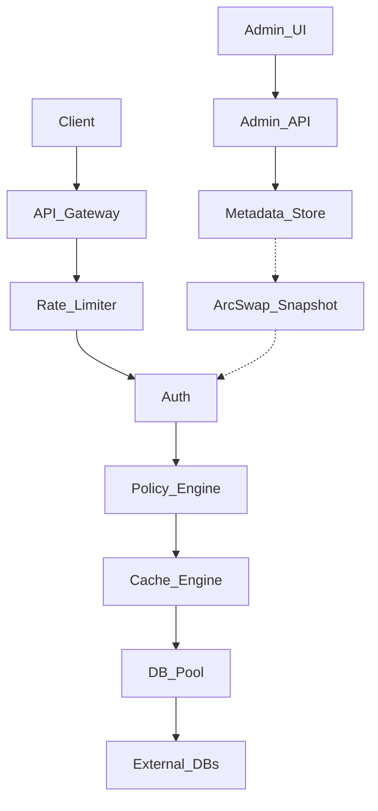

# Axiom Master Plan - v4.0

## Section 1: Product Vision
Axiom is a single-binary Rust database API gateway. It provides a secure, fast, and configuration-driven HTTP layer over existing databases. Version 4.0 aims to consolidate internal architecture, introduce a unified control plane with a Web UI, establish a robust RBAC policy engine, and standardize caching mechanisms—all while maintaining the single-binary deployment model and achieving extreme performance.

## Section 2: Architecture Principles
1. **Single Binary:** Everything (API, CLI, UI) is packaged in one binary.
2. **Zero-DB Hot Path:** Data API requests never query the metadata store (`axiom.db`) synchronously.
3. **Unified Caching:** One unified cache engine (DashMap + SQLite AOF) for all temporary data.
4. **Configuration Hierarchy:** Defaults → `config.toml` (startup only) → Env Vars → CLI Flags.
5. **Separation of Planes:** Distinct Data Plane (hot path) and Control Plane (UI, admin, metadata).
6. **No Silent Failures:** Explicit error handling and structured observability.
7. **Performance First:** No performance claim ships without a benchmark.
8. **Stateless Scalability:** Nodes can scale horizontally if sharing a metadata store.
9. **Backward Compatibility:** `X-Axiom-Key` and existing `config.toml` routing must not break.
10. **Operator Centric:** Operator defines the roles and permissions; no built-in data plane roles.

## Section 3: Existing Architecture Audit
Phase 0 hot-path cleanup items to fix:
1. `handlers.rs:68,91` — `ConfigManager::get()` called twice.
2. `base.rs:42` — `Box<dyn Error>` on hot path.
3. `auth.rs:41` + `rate_limit.rs:30` — BanList checked twice.
4. `handlers.rs:66` — `CIRCUIT_FAILURES` static inside function body.
5. `handlers.rs:48-53` — Arbitrary cache eviction (not LRU).
6. `schema.rs:208` — `full_admin: bool` hardcoded privilege.
7. `handlers.rs:89` — Regex + AST parse both run on every uncached request.
8. `pool.rs:33` — Single global `INIT_LOCK`.
9. `cache.rs` — 3 disconnected cache stores.
10. All handlers — Response shape built inline.

Security bypass fixes (Phase 0):
- **S1:** Warn on startup if `trusted_proxies = ["*"]`.
- **S2:** Add `rl:key:{name}` counter alongside `rl:ip:{ip}` in rate limiter.
- **S3:** Global failed-auth counter per key name; ban key after threshold regardless of source IP.

## Section 4: Competitive Research
- **Faucet:** Simplicity is good, but lacks enterprise observability.
- **Hasura:** Powerful, but complex runtime and heavy GraphQL focus. Axiom will remain REST/SQL focused.
- **DreamFactory:** Good auto-generation of APIs, but bloated. Axiom must stay lightweight.
- **Redis:** Exceptional caching models. Axiom's unified cache will adopt clear eviction policies and TTL sweeps akin to Redis.

## Section 5: Target Architecture


## Section 5.1: Physical Workspace Structure
```
axiom/
├── Cargo.toml (Workspace Root)
├── crates/
│   ├── core/         # Shared traits, Error enums, common types
│   ├── metadata/     # libsql identity store (axiom.db), ArcSwap snapshots
│   ├── policy/       # RBAC evaluation engine
│   ├── cache/        # Unified L1/L2 cache engine (DashMap + AOF SQLite)
│   ├── db/           # Connection pooling and SQL engine implementations
│   └── api/          # Axum HTTP routes, Middlewares, Web UI embedding
├── binaries/
│   ├── server/       # Main daemon binary
│   └── cli/          # 'axiom' command-line tool
├── ui/               # Vite + TypeScript + Tailwind CSS web UI
├── benches/          # Go benchmark suite
├── docs/             # Public reference docs
└── v4-planning/      # This folder
```

## Section 6: Core Engines
- **Metadata Engine:** Manages `axiom.db` using libsql for storing users, api keys, and RBAC policies. Provides ArcSwap snapshots.
- **Policy Engine:** Evaluates RBAC rules for incoming requests against the ArcSwap snapshot. Single authorization checkpoint.
- **Cache Engine:** Unified L1 (DashMap) and L2 (SQLite AOF) cache for query results, rate limits, and idempotency.
- **Database Engine:** Manages connection pools (sqlx, tiberius) and SQL dialect translations to target databases.
- **API Engine:** Axum-based HTTP routing, middleware pipeline, and web UI embedding.

## Section 7: API Specification
- `/api/v1/*`: Data Plane (queries, operations). Response envelope unchanged.
- `/admin/v1/*`: Control Plane (users, keys, metrics).
- `/mcp/v1/*`: Model Context Protocol endpoints (Phase 4).
- `/ui/`: Web UI interface.
- `/ui/setup` (and `/admin/v1/setup/*`): First-time setup wizard.

## Section 8: Identity and RBAC Model
- **Human Admins:** `users` table. Username + Argon2 hash. UI access only.
- **API Keys:** Machine access to Data API. Format: `X-Axiom-Key: base64(name:secret)`. Secret stored as BLAKE3 hash.
- **Tables:** `roles`, `permissions`, `api_keys`. Operations: SELECT, INSERT, UPDATE, DELETE. Supports wildcards.
- **Flow:** Data API checks `ArcSwap<Metadata>` for key validity and RBAC policy. Zero hot-path DB calls.

## Section 9: Security Architecture
- Pipeline: WAF → Rate Limit (`rl:ip` and `rl:key`) → Auth (BLAKE3 check against ArcSwap) → Policy (RBAC eval).
- Security fixes (S1-S3) integrated to prevent proxy bypass and brute-force auth.
- Standard security headers applied to all responses.

## Section 10: Cache Architecture
- **L1 Cache:** DashMap RAM layer, true LRU eviction.
- **L2 Cache:** Optional SQLite AOF persistence.
- **Durability Levels:** ephemeral, memory-only, journaled, snapshot, journaled+snapshot.
- **TTL Sweep:** Background sweep using `BinaryHeap`.
- **Stats:** Hit/miss rates, memory usage, eviction counts exposed to metrics.

## Section 11: Database Architecture
- Engines supported via `sqlx` and `tiberius`.
- Global `INIT_LOCK` removed; per-alias connection pools.
- Circuit breaker implemented properly, independent of cache eviction.

## Section 12: Logging and Observability Architecture
- Structured JSON logging.
- Prometheus metrics endpoint for request stats, cache stats, and pool stats.
- Audit log for all control plane modifications (admin actions).

## Section 13: Configuration Architecture
- Hierarchy: Defaults → `config.toml` → Env Vars → CLI Flags.
- `config.toml` contains ONLY startup settings (`server`, `logging`, `rate_limit`, `cache`, `circuit_breaker`, `metadata`).
- API keys and DB connections managed at runtime via UI/API and persisted to `axiom.db`.
- Legacy `[api_key.*]` / `[database.*]` blocks auto-seeded on first boot.

## Section 14: CLI Architecture
- Subcommands: `axiom server run`, `axiom user add`, `axiom key create`, `axiom db add`.
- Output formats: plain text, JSON (`--json`).

## Section 15: Web UI Architecture
- Stack: Vite + TypeScript + Tailwind CSS. Pre-built and embedded via `rust-embed` at `/ui/`.
- Setup Wizard: `/ui/setup` (Welcome → Admin Account → Connect DB → Done). Locked after completion.
- Design: Dark mode (bg `#1F1F1F`, surface `#454545`, text `#F5F5F5`, secondary `#A1A1A1`, accent orange `#F6821F`, accent blue `#4693FF`, danger `#AE292F`), GeistSans/Inter font, dense and technical.
- Pages: Overview, Databases, API Keys, Roles, Cache, Logs, Audit, Metrics, Security, System.

## Section 16: Federation Architecture
- Out of scope for v4.
- Extension points will be left in the API Engine and DB Engine to support future cross-node query federation.

## Section 17: MCP Architecture
- Phase 4 addition.
- `/mcp/v1` endpoint for AI agent access.
- Operates under the same RBAC policy enforcement as the data API.

## Section 18: Scaling Strategy
- Single node by default.
- Stateless horizontally scalable nodes when pointing the `metadata` config to a central remote Turso DB.

## Section 19: Resource Profiles
| Profile | Description | Memory Target |
|---|---|---|
| Minimal | Edge, IoT, tight containers | <10MB Idle RSS |
| Standard | Default server usage | <30MB Idle RSS |
| Production | High throughput, large L1 | Configurable L1 size |
| Enterprise | High HA, remote metadata | High cache + metrics |

## Section 20: Performance Targets
| Metric | Target | Test Condition |
|---|---|---|
| Cache GET (L1 hot) | <1µs p50 | High concurrency GET |
| Auth (warm snapshot) | <5µs | Pre-warmed ArcSwap |
| Full pipeline, cache hit | <500µs p50 | HTTP to HTTP |
| Full pipeline, local DB | <2ms p50 | SQLite backend |
| Binary size stripped | <15MB | Cargo release build |
| Cold start to first 200 | <200ms | System boot |
| Idle RSS minimal | <10MB | Profile: minimal |
| Idle RSS standard | <30MB | Profile: standard |

## Section 21: Benchmark Methodology
- Suites written in Go.
- Compare against raw direct DB access and v3.0.1.
- Record p50, p95, p99, max latency, throughput, and error rates.

## Section 22: Security Test Environment
- Fuzz testing for header parsing and AST injection.
- Automated rate-limit brute-force tests.
- RBAC permutation checks to ensure no escalation.

## Section 23: Failure and Recovery Strategy
| Subsystem | Failure Policy |
|---|---|
| Metadata Store | Serve from ArcSwap; retry sync background |
| Cache Engine L2 | Fallback to L1; log warning |
| DB Connection | Trip circuit breaker; return 503 |

## Section 24: Testing Strategy
- Unit: Core logic, cache LRU, policy eval.
- Integration: HTTP API flows.
- API/Load: Go bench suite.
- Fuzz: Axum handlers.
- Soak: 30min steady-state load test required before release.

## Section 25: Migration Strategy
- `config.toml` legacy keys (`[api_key.*]`, `[database.*]`) read once on startup and seeded to `axiom.db`.
- Drop-in binary replacement.

## Section 26: Compatibility Requirements
- `/api/v1/` responses shape unchanged.
- `X-Axiom-Key` header format unchanged.
- Legacy `config.toml` blocks must not break routing but will be migrated internally.
- Single binary structure must remain.

## Section 27: Implementation Phases
| Phase | Name | Goal | Measurable Output |
|---|---|---|---|
| 0 | Hot-path cleanup | Fix 10 debt items + 3 security bypasses | PRs merged |
| 1 | Metadata Store + Identity | `axiom.db`, ArcSwap, Admin API | API auth tests pass |
| 2 | Policy Engine / RBAC | Enforce roles | RBAC unit tests pass |
| 3 | CLI | `axiom` subcommands | CLI functional |
| 4 | MCP Engine | `/mcp/v1` implementation | AI agents can query |
| 5 | Cache Engine | L1/L2 unified cache | Benchmark target met |
| 6 | Observability | Prometheus, audit log | Metrics endpoint active |
| 7 | Web UI | Setup wizard, embedded Vite app | UI loads in browser |
| 8 | Hardening | Fuzz, 30min soak, CI | CI green |

## Section 28: Technical Decisions Log
| Decision | Options | Chosen | Why |
|---|---|---|---|
| Cache | 3 separate vs Unified | Unified | Consistency, simpler memory tracking |
| UI | React vs Vite+TS | Vite+TS | No framework runtime overhead, fast |
| Admin Auth | JWT vs Argon2 Sessions | Argon2 | Simpler single-binary self-hosting |
| Metadata | SQLite vs libsql | libsql | Allows remote Turso sync |

## Section 29: Open Problems
- Handling dynamic cluster re-elections for multi-node rate limiting without Redis.
- Advanced SQL AST parsing overhead for highly complex wildcard policies.

## Section 30: Future Work
- GraphQL / gRPC support.
- Vector DB adapters for AI RAG pipelines.
- Distributed cache federation (Gossip).
